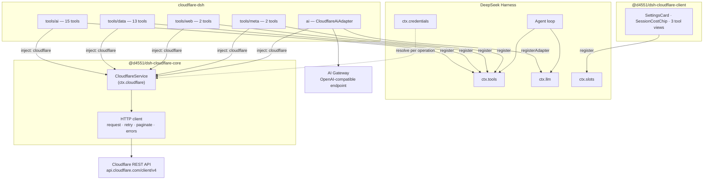
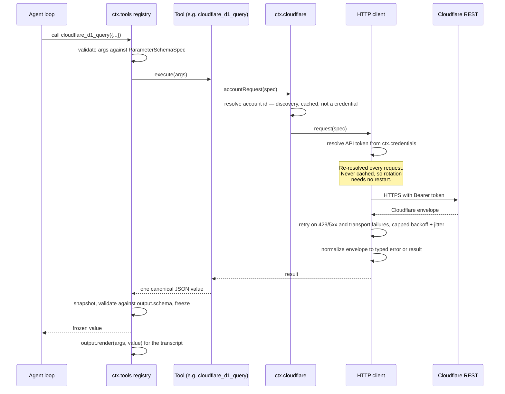
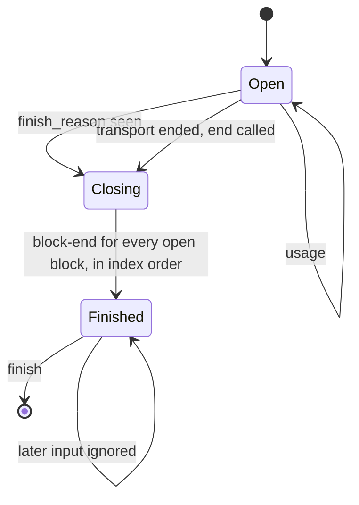
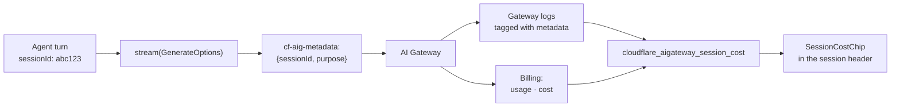
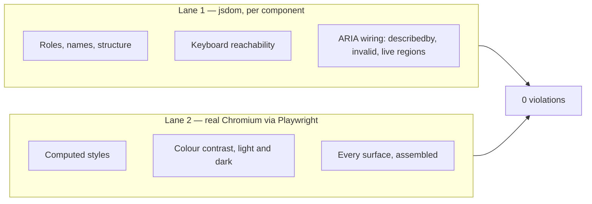
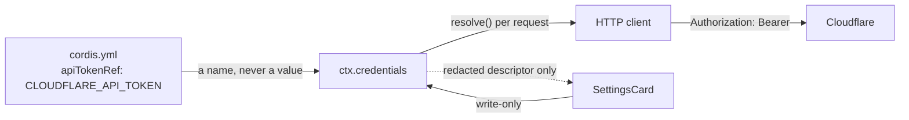

<div align="center">

# cloudflare-dsh

**Cloudflare tools, an AI Gateway model provider, and MCP passthrough for [DeepSeek Harness](https://github.com/deepseek-ai/deepseek-harness).**

[](https://github.com/d4551/cloudflare-dsh/actions/workflows/ci.yml)
[](#quality)
[](#quality)
[](#accessibility)
[](#accessibility)
[](tsconfig.base.json)
[](package.json)
[](LICENSE)

</div>

---

## Explain like I'm 5

Imagine you have a very capable assistant who can write and run code for you.
That assistant is **DeepSeek Harness** (DSH).

Now imagine you also rent a huge amount of internet plumbing from **Cloudflare**:
somewhere to keep files, somewhere to keep a database, a robot that can open web
pages for you, and a bank of GPUs that can run AI models.

Your assistant cannot touch any of that on its own. It does not know your
account exists.

**This project is the set of hands.** Install it, and three things happen:

1. **The assistant gets tools.** It can now say "put this in the database",
   "read that web page", "run this AI model" — 32 specific, typed actions
   instead of a vague "call an API somewhere".
2. **The assistant can think using Cloudflare's own AI.** Not just _call_
   Cloudflare models as a tool — actually _be powered by_ them, routed through
   your AI Gateway.
3. **You get the receipts.** Every one of those thinking-requests is stamped
   with which conversation it came from. So when you ask "what did that
   conversation cost me?", there is a real answer from Cloudflare's billing
   data, not an estimate.

That third one is the interesting part, and it is the reason this project
exists rather than just being a list of API wrappers.

<details>
<summary><strong>The same thing, one level up</strong></summary>

DSH plugins are Cordis fibers. This repository ships a **bundle** — an npm
package declaring `dsh.bundle.patch`, which contributes a layer of rows to a
profile's plugin tree. One row provides a service (`ctx.cloudflare`); the others
consume it to register tools and one `LlmAdapter`.

The adapter is what makes session-level cost attribution possible: DSH passes
`sessionId` on every `GenerateOptions`, the adapter maps it into the
`cf-aig-metadata` header, and AI Gateway then reports usage and cost keyed by
that value. The correlation is exact, not inferred from timestamps.

</details>

---

## Contents

- [What you get](#what-you-get)
- [Install](#install)
- [Architecture](#architecture)
- [How a tool call flows](#how-a-tool-call-flows)
- [How a model call flows](#how-a-model-call-flows)
- [Per-session cost attribution](#per-session-cost-attribution)
- [Tool catalogue](#tool-catalogue)
- [The model provider](#the-model-provider)
- [Configuration](#configuration)
- [Web Client surfaces](#web-client-surfaces)
- [Accessibility](#accessibility)
- [MCP passthrough](#mcp-passthrough)
- [Security model](#security-model)
- [Quality](#quality)
- [Development](#development)
- [Project status](#project-status)
- [License](#license)

---

## What you get

|                              |                                                                                                                                                     |
| ---------------------------- | --------------------------------------------------------------------------------------------------------------------------------------------------- |
| **36 tools**                 | Workers AI, AI Gateway, AI Search, Vectorize, KV, D1, Queues, R2, Browser Rendering, plus one bounded generic REST tool                             |
| **A model provider**         | Two routes — `cloudflare-workers-ai` and `cloudflare-ai-gateway` — registered as a real `LlmAdapter`, streaming SSE into the harness chunk contract |
| **Session cost attribution** | `cf-aig-metadata` carries the harness session id and call purpose, so gateway logs and billing join to sessions exactly                             |
| **Web Client surfaces**      | A settings card, a per-session usage chip, and three tool views, all WCAG 2.2 AA                                                                    |
| **MCP passthrough**          | Patch rows for Cloudflare's eight hosted MCP servers, off by default                                                                                |

### Packages

| Package                            | Role                                                                                                                                |
| ---------------------------------- | ----------------------------------------------------------------------------------------------------------------------------------- |
| **`@d4551/dsh-cloudflare-core`**   | The `ctx.cloudflare` capability seam — credential resolution, scoping, request construction, error normalization, pagination, retry |
| **`cloudflare-dsh`**               | The bundle — four tool groups, the model provider, MCP rows, presets, and the `cordis.patch.yml` layer                              |
| **`@d4551/dsh-cloudflare-client`** | Web Client surfaces — settings card, session usage chip, tool views                                                                 |

The three packages exist because they have genuinely different consumers.
Another bundle may want `ctx.cloudflare` without any of these tools; the client
package has its own build requirements (React, a client tsconfig, `dsh.client`)
that the headless packages must not inherit.

---

## Install

```sh
dsh plugin --profile <name> add cloudflare-dsh @d4551/dsh-cloudflare-core
```

Then supply the API token through the environment. The configuration names the
variable; it never holds the value:

```sh
export CLOUDFLARE_API_TOKEN=...
```

For the Web Client surfaces, also install the client package into the profile:

```sh
dsh plugin --profile <name> add @d4551/dsh-cloudflare-client
```

### API token scopes

Minimum permission groups for the shipped tools:

`Workers AI Read/Write` · `AI Gateway Read/Write` · `Vectorize Write` ·
`Workers KV Storage Write` · `D1 Write` · `Workers R2 Storage Write` ·
`Queues Write` · `Account Settings Read`

> [!NOTE]
> The Cloudflare dashboard labels these groups **Edit** where the API calls them
> **Write**. Use `Write` when minting a token through the API.

The account id is optional when the token can reach exactly one account: it is
discovered once and reused. A token that can reach several makes discovery
ambiguous, so the plugin refuses to guess and asks for `accountId`, naming the
accounts it saw.

---

## Architecture

The bundle is organised around a single capability seam. Everything that talks
to Cloudflare goes through `ctx.cloudflare`; everything else is a consumer of
it. That is what keeps credentials in one place, error handling in one place,
and the tool modules free of transport concerns.



### The capability seam

DSH's own convention is that a capability is complete only when all three roles
exist: a **service definition**, a **provider**, and a **consumer**. Here:

| Role       | Where                                                                 |
| ---------- | --------------------------------------------------------------------- |
| Definition | `CloudflareService` class and its typed surface                       |
| Provider   | `packages/core` — registers itself as `ctx.cloudflare`                |
| Consumers  | Every tool group and the model provider, via `inject: ['cloudflare']` |

### Why the pure/impure split

In `packages/core`, exactly one module dispatches a request: `client.ts`. The
service supplies the default `fetch` and nothing else there touches the network.
Everything else — path building, scope resolution, query serialization, error
mapping, pagination stepping, retry policy — is a pure function. The same is
true of the adapter: `transducer.ts` holds the entire streaming contract as a
state machine with no clock, no network and no randomness, and `adapter.ts` is
a thin shell around it.

This is not stylistic. It is what makes a 100% mutation score reachable
honestly: every branch that matters can be driven from a literal array of
fixture inputs, so a surviving mutant means a real gap rather than an
untestable seam.

---

## How a tool call flows



Two properties are worth calling out.

**The canonical value is a programmatic API.** DSH runs tools in PTC mode,
meaning generated code can call `await tools.cloudflare_kv_list_keys({...})` and
receive the value directly. So results carry ids and cursors that feed the next
call rather than prose a model has to parse. `cloudflare_kv_list_keys` returns
`{ keys, cursor, complete }` precisely so a generated loop can page, and every
list tool pages the way its endpoint does: page-numbered endpoints take `page`
and `perPage` and return `page`, `perPage`, `total` (when Cloudflare reports
one, else `null`) and `complete`; cursor endpoints (`cloudflare_kv_list_keys`,
`cloudflare_r2_bucket_list`) return `cursor` and `complete`; and
`cloudflare_queue_list`, whose endpoint takes no paging parameters, returns the
whole listing and says if the API reported more than it returned. Every tool
declares a closed output object with each field described and required; the
registry validates a value against it before the model or generated code sees
it, and a presenter reads typed fields rather than casting.

**Presenters are pure.** `output.render` runs during session-log replay, so it
performs no I/O, reads no clock and uses no randomness.

**Cancellation reaches Cloudflare.** `timeoutMs` on a tool is declarative — the
registry does not interrupt a body — so every tool forwards `exec.signal` into
its request, and a tool with a budget of its own (`inferenceTimeoutMs`,
`renderTimeoutMs`) makes that budget the request deadline as well, so a 120 s
inference is not cut off by the 30 s client default.

---

## How a model call flows

The adapter's job is to turn one HTTP response into the harness's `StreamChunk`
sequence, honouring the ordering guarantees the harness depends on.

```mermaid
sequenceDiagram
    participant L as ctx.llm
    participant AD as CloudflareAiAdapter
    participant EP as Endpoint resolver
    participant GW as AI Gateway / Workers AI
    participant TR as StreamTransducer

    L->>AD: prepareCall(provider, model)
    AD->>EP: resolveEndpoint + resolveModel, once per generation
    EP->>GW: GET ai-gateway gateways URL endpoint (first call only)
    Note over EP: Base URL comes from the API and is<br/>remembered per plugin instance; the token never is.
    EP-->>AD: { url, token } + model facts (context window, modalities)
    L->>AD: prepared.stream(GenerateOptions)
    AD->>AD: buildWireRequest — images projected to text, reasoning left out, unsupported options rejected
    AD->>AD: attributionHeaders() first, then buildGatewayHeaders — cf-aig-metadata carries sessionId + purpose
    AD->>GW: POST chat/completions (stream, caller AbortSignal forwarded)
    loop while the stream is alive
        GW-->>AD: SSE frames
        AD->>TR: push(parsed frame)
        TR-->>AD: StreamChunk[]
        AD-->>L: yield chunks
    end
    GW-->>AD: data: [DONE]
    AD->>AD: no content block opened? → EMPTY_RESPONSE
    AD->>TR: end()
    TR-->>AD: block-end… usage… finish
    AD-->>L: final chunks
    Note over AD: Reader is cancelled in `finally`,<br/>so an abandoned turn frees the connection.
```

### Streaming contract

The transducer is where the contract lives, and it is enforced by construction
rather than convention:



| Obligation                                             | How it holds                                                                                                                                                                                                                          |
| ------------------------------------------------------ | ------------------------------------------------------------------------------------------------------------------------------------------------------------------------------------------------------------------------------------- |
| `usage` is emitted before `finish`                     | The finish reason closes the blocks but is held back until the stream ends, so a provider that reports usage in a trailing chunk — the shape `stream_options.include_usage` produces — is still observed, and `finish` is always last |
| Nothing follows `finish`                               | A `finished` flag makes every later `push`/`end` a no-op                                                                                                                                                                              |
| Block indices allocated in first-seen order and reused | One allocator, one map keyed by wire index                                                                                                                                                                                            |
| Tool-call `arguments` stay raw JSON strings            | Fragments accumulate as `argumentsDelta`, re-joined at `block-end`, never parsed                                                                                                                                                      |
| One adapter call is one provider attempt               | No internal retry — the harness owns retry policy                                                                                                                                                                                     |
| `options.signal` is honoured                           | Forwarded to `fetch` unconditionally (`null` is the documented "no signal")                                                                                                                                                           |
| A quiet stream fails as a timeout                      | Every read races the configurable idle budget                                                                                                                                                                                         |
| Unsupported options fail loudly                        | Rejected before any request is issued                                                                                                                                                                                                 |
| Every provider request carries attribution             | `attributionHeaders()` is the first thing set on the request; nothing after it can replace the header                                                                                                                                 |
| A completion with no content is a failure              | `EMPTY_RESPONSE`, whether it ended with a finish reason, the `[DONE]` sentinel, or the socket; usage alone is not content                                                                                                             |
| Every finish reason has a meaning                      | `stop`, `tool_calls` and `length` map to the harness kinds; `content_filter` and anything unknown are an `error` finish naming the reason                                                                                             |
| Every content block has a stated fate                  | Text is sent; tool calls and results round-trip, text beside results included; images become the harness's text through its own helper; reasoning is left out, as OpenAI-compatible reasoning APIs refuse it in input                 |
| A tool call always has an id                           | The provider's when it sends one; a deterministic `call_<index>` when it never does, since an empty id cannot be correlated with its result                                                                                           |

---

## Per-session cost attribution

This is the feature the architecture is shaped around.



`GenerateOptions.purpose` is the bonus: DSH marks auxiliary calls as
`compaction` or `session-title`, so housekeeping is attributable separately from
real agent turns.

> [!IMPORTANT]
> The declarative path (`presets/pi-ai.yaml`, using the `llm-pi-ai` adapter DSH
> already ships) works on day one and costs nothing to adopt — but it cannot set
> `cf-aig-*` headers, so it gets no session correlation. That is the concrete
> reason this bundle ships a real adapter rather than only a preset.

---

## Tool catalogue

Tools are grouped into four modules, mounted as separate patch rows, so a
profile takes only the groups it wants.

### AI — `cloudflare-dsh/tools/ai` (18)

| Tool                                             | Purpose                                         |
| ------------------------------------------------ | ----------------------------------------------- |
| `cloudflare_ai_run`                              | Run any Workers AI model, one complete response |
| `cloudflare_ai_models_search`                    | Search the model catalogue                      |
| `cloudflare_ai_model_schema`                     | Fetch a model's live JSON schema                |
| `cloudflare_aigateway_list` / `_get`             | Enumerate and inspect gateways                  |
| `cloudflare_aigateway_logs`                      | Page gateway request logs                       |
| `cloudflare_aigateway_log_body`                  | Fetch a logged request or response body         |
| `cloudflare_aigateway_routes`                    | Dynamic routing configuration                   |
| `cloudflare_aigateway_cost`                      | Credit balance, usage history, invoice preview  |
| `cloudflare_aigateway_session_cost`              | Usage and cost for one harness session          |
| `cloudflare_aisearch_search` / `_chat` / `_sync` | AI Search query, chat completion, index sync    |
| `cloudflare_vectorize_index_list` / `_query`     | Vector index listing and similarity query       |
| `cloudflare_vectorize_upsert`                    | Write vectors as NDJSON, upsert or insert       |
| `cloudflare_vectorize_delete` / `_get`           | Delete and read vectors back by id              |

### Data — `cloudflare-dsh/tools/data` (13)

| Tool                                                 | Purpose                                    |
| ---------------------------------------------------- | ------------------------------------------ |
| `cloudflare_kv_namespace_list`                       | List KV namespaces                         |
| `cloudflare_kv_list_keys`                            | Page keys — returns a cursor for PTC loops |
| `cloudflare_kv_get` / `_put` / `_delete`             | Single-key value operations                |
| `cloudflare_d1_list`                                 | List D1 databases                          |
| `cloudflare_d1_query`                                | Parameterised SQL, multi-statement         |
| `cloudflare_queue_list` / `_send` / `_pull` / `_ack` | Queue operations, lease-based              |
| `cloudflare_r2_bucket_list` / `_create`              | R2 bucket management                       |

### Web — `cloudflare-dsh/tools/web` (3)

| Tool                                    | Purpose                                                                         |
| --------------------------------------- | ------------------------------------------------------------------------------- |
| `cloudflare_browser_render`             | Markdown, content, links, scrape, JSON                                          |
| `cloudflare_browser_screenshot`         | A screenshot, kept as a durable image attachment and returned as an image block |
| `cloudflare_browser_accessibility_tree` | The roles, names and structure a screen reader would expose for any URL         |

`cloudflare_browser_accessibility_tree` is the standout: it hands an agent the
same tree an assistive technology would consume, which is exactly what a WCAG
review needs and what a screenshot cannot provide.

`cloudflare_browser_screenshot` needs an attachment store in the composition
(`@deepseek-ai/dsh-attachment-local` in the shipped `dsh`), because that store
is the harness's one durable home for image bytes. A model that accepts images
sees the page, the client shows it, and a text-only model is told the image was
omitted. PDF capture is not offered: a PDF is not a raster image, so the store
cannot hold it, and a base64 PDF in the session log would be a blob nothing
can consume.

### Meta — `cloudflare-dsh/tools/meta` (2)

| Tool                      | Purpose                                                           |
| ------------------------- | ----------------------------------------------------------------- |
| `cloudflare_account_list` | Account discovery                                                 |
| `cloudflare_api`          | Bounded generic REST call for resources this bundle does not wrap |

---

## The model provider

Mounted as the `cloudflare-llm` row (`cloudflare-dsh/ai`), registering two
routes:

| Route                   | Endpoint                                        | Notes                                        |
| ----------------------- | ----------------------------------------------- | -------------------------------------------- |
| `cloudflare-workers-ai` | The account's OpenAI-compatible Workers AI path | Works with defaults                          |
| `cloudflare-ai-gateway` | Base URL resolved from the gateway URL endpoint | Needs `gatewayId`; says so loudly if missing |

Registration is inert until a session selects one of the routes, so mounting the
row costs nothing.

### Error mapping

Provider failures are mapped onto the harness's canonical vocabulary rather than
surfaced raw:

| Signal                                    | Code                      |
| ----------------------------------------- | ------------------------- |
| Context/token-length error text           | `CONTEXT_WINDOW_EXCEEDED` |
| Quota exhausted                           | `QUOTA_EXCEEDED`          |
| HTTP 429                                  | `RATE_LIMIT`              |
| Idle beyond `streamIdleTimeoutMs`         | `TIMEOUT`                 |
| A completion with no content block at all | `EMPTY_RESPONSE`          |
| A completion withheld by content policy   | `CONTENT_FILTER` (finish) |
| Any option the wire format cannot express | `UNSUPPORTED_OPTION`      |
| Anything else from the provider           | `PROVIDER_ERROR`          |

Two adapter hooks keep the harness defaults, deliberately: `providerRetryPolicy`,
because Cloudflare publishes no route-owned retry policy beyond the
`retry-after` a rate-limit failure already carries, and `imageRequestPricing`,
because Cloudflare prices vision input per token, not per image.

---

## Configuration

Every deployment-varying value is a validated Schemastery field, changeable from
`cordis.yml` without a code edit. There are no tunables hidden as constants.

> [!WARNING]
> A patch layer **replaces** a row's entire `config` value rather than merging
> into it. That is why each row's configuration is small and local: overriding
> one key never forces you to restate the rest.

### `cloudflare` — the seam (`@d4551/dsh-cloudflare-core`)

| Field              | Default                                | Meaning                                                                                                                                                                                                    |
| ------------------ | -------------------------------------- | ---------------------------------------------------------------------------------------------------------------------------------------------------------------------------------------------------------- |
| `apiTokenRef`      | `CLOUDFLARE_API_TOKEN`                 | Credential reference — a POSIX env-var **name**, never a value                                                                                                                                             |
| `accountId`        | `''`                                   | Account to operate on; discovered at first use when empty                                                                                                                                                  |
| `baseUrl`          | `https://api.cloudflare.com/client/v4` | REST root; overridable for API-compatible proxies                                                                                                                                                          |
| `requestTimeoutMs` | `30000`                                | Deadline for one attempt, aborting the request. A retry gets a fresh budget, so this caps an attempt rather than the whole retried operation; a tool with a longer budget of its own passes it per request |
| `maxRetries`       | `3`                                    | Retry budget for transient failures                                                                                                                                                                        |
| `retryBaseDelayMs` | `250`                                  | First backoff step                                                                                                                                                                                         |
| `retryMaxDelayMs`  | `10000`                                | Backoff ceiling, and the cap applied to a server `Retry-After`                                                                                                                                             |
| `maxPages`         | `100`                                  | Hard ceiling on pages walked by one list call                                                                                                                                                              |

### `cloudflare-llm` — the model provider (`cloudflare-dsh/ai`)

| Field                 | Default                   | Meaning                                                          |
| --------------------- | ------------------------- | ---------------------------------------------------------------- |
| `gatewayId`           | `''`                      | Gateway to route through; required for the gateway route         |
| `gatewayProvider`     | `workers-ai`              | Provider slug the gateway forwards to                            |
| `chatCompletionsPath` | `/chat/completions`       | Path appended to the resolved base URL                           |
| `workersAiPath`       | `/ai/v1/chat/completions` | OpenAI-compatible Workers AI path, relative to the account scope |
| `cacheTtlSeconds`     | `0`                       | `cf-aig-cache-ttl`                                               |
| `skipCache`           | `false`                   | `cf-aig-skip-cache`                                              |
| `collectLog`          | `true`                    | `cf-aig-collect-log` — required for session cost attribution     |
| `tags`                | `{}`                      | Static tags merged into `cf-aig-metadata`                        |
| `streamIdleTimeoutMs` | `300000`                  | How long a stream may go quiet before failing as a timeout       |
| `models`              | `[]`                      | Advertised models; empty means query the catalogue               |

### `cloudflare-tools-ai` (`cloudflare-dsh/tools/ai`)

| Field                | Default  | Meaning                                                                                 |
| -------------------- | -------- | --------------------------------------------------------------------------------------- |
| `pageSize`           | `50`     | Default page size for the model catalogue and gateway listings                          |
| `searchMaxResults`   | `10`     | Default number of chunks `cloudflare_aisearch_search` returns                           |
| `vectorTopK`         | `5`      | Default number of matches `cloudflare_vectorize_query` returns                          |
| `inferenceTimeoutMs` | `120000` | Budget for tools that wait on model inference: the tool's own, and its request deadline |

### `cloudflare-tools-data` (`cloudflare-dsh/tools/data`)

| Field                      | Default | Meaning                                                              |
| -------------------------- | ------- | -------------------------------------------------------------------- |
| `pageSize`                 | `50`    | Default page size for namespace, database, queue and bucket listings |
| `keyListLimit`             | `1000`  | Default number of keys `cloudflare_kv_list_keys` returns per page    |
| `renderLimit`              | `4000`  | Characters of a KV value shown to the model before truncation        |
| `queueBatchSize`           | `10`    | Default number of messages `cloudflare_queue_pull` takes             |
| `queueVisibilityTimeoutMs` | `30000` | Default time pulled messages stay invisible to other consumers       |

### `cloudflare-tools-web` (`cloudflare-dsh/tools/web`)

| Field                | Default  | Meaning                                                                     |
| -------------------- | -------- | --------------------------------------------------------------------------- |
| `renderLimit`        | `8000`   | Characters of a rendered page or accessibility tree shown before truncation |
| `renderTimeoutMs`    | `120000` | Budget for a real browser render: the tool's own, and its request deadline  |
| `screenshotType`     | `png`    | Image encoding of a screenshot when the call does not choose one            |
| `screenshotFullPage` | `false`  | Whether a screenshot captures the whole page when the call does not say     |

### `cloudflare-tools-meta` — the escape hatch (`cloudflare-dsh/tools/meta`)

| Field              | Default | Meaning                                                        |
| ------------------ | ------- | -------------------------------------------------------------- |
| `allowMutations`   | `false` | When false, `cloudflare_api` rejects anything but `GET`/`HEAD` |
| `denyPathPrefixes` | `[]`    | Path prefixes `cloudflare_api` refuses outright                |

### The shipped patch layer

```yaml
- insert:
    - id: cloudflare
      name: '@d4551/dsh-cloudflare-core'
      config:
        apiTokenRef: CLOUDFLARE_API_TOKEN
    - id: cloudflare-tools-ai
      name: 'cloudflare-dsh/tools/ai'
    - id: cloudflare-tools-data
      name: 'cloudflare-dsh/tools/data'
    - id: cloudflare-tools-web
      name: 'cloudflare-dsh/tools/web'
    - id: cloudflare-llm
      name: 'cloudflare-dsh/ai'
    - id: cloudflare-tools-meta
      name: 'cloudflare-dsh/tools/meta'
      config:
        allowMutations: false
        denyPathPrefixes: []
```

---

## Web Client surfaces

`@d4551/dsh-cloudflare-client` contributes to three slots. Components never
receive `ctx`; they take props.

| Component           | Slot                                                           | What it shows                                                               |
| ------------------- | -------------------------------------------------------------- | --------------------------------------------------------------------------- |
| `SettingsCard`      | `settings.plugin.cloudflare`                                   | Credential reference, account and gateway selection. Write-only for secrets |
| `SessionCostChip`   | `conversation.session.header.actions`                          | This session's requests, cost, cache hit rate and token counts              |
| `D1Result`          | `tool.call.toolview` → `cloudflare_d1_query`                   | A real table with column headers and a caption naming the query             |
| `BrowserRender`     | `tool.call.toolview` → `cloudflare_browser_render`             | Rendered text, captioned with the page it came from                         |
| `AccessibilityTree` | `tool.call.toolview` → `cloudflare_browser_accessibility_tree` | The tree as nested lists rather than a flat dump                            |

The package ships `cloudflare.css`. Colours are CSS custom properties, so a
host's theme wins wherever it defines them.

All user-facing copy routes through a typed dictionary in `locales/en.ts`,
including accessible names — those are part of the interface, not decoration.

---

## Accessibility

Upstream DSH ships no accessibility guidance for plugin authors. This project
sets its own bar: **WCAG 2.2 AA, zero axe violations, enforced in CI**.

Accessibility runs in two lanes because one is not enough:



The split exists for a measured reason: axe-core's colour-contrast rule cannot
run under jsdom ([axe-core#595](https://github.com/dequelabs/axe-core/issues/595))
because it needs computed styles. Components that pass in isolation can still
conflict once composed, so the assembled client gets its own scan in both colour
schemes.

**Neither lane filters axe.** No tag scope, no disabled rules, no excluded
selectors. The Chromium fixture supplies the landmarks, page heading and chrome
colours a host would provide, so page-scoped rules fail on a real defect rather
than on an unrealistic harness.

Specific commitments, covered by tests:

- Every input has a programmatic label; secret fields are `type=password` with
  `autocomplete=off`.
- Errors are wired with `aria-describedby` and announced in a live region
  (SC 3.3.1, 4.1.3); the region stays mounted and empty until it has something
  to say.
- Status messages land in a polite `role="status"` region.
- Tables are real tables with header cells and a caption naming the query.
- Scroll containers are keyboard-reachable and named.
- Screenshots carry meaningful alternative text.

---

## MCP passthrough

`cloudflare-dsh/mcp` exports patch rows for Cloudflare's eight hosted MCP
servers: docs, bindings, observability, radar, browser, AI Gateway, AutoRAG and
Logpush.

**Nothing ships enabled.** Each server is a remote endpoint reached outside the
agent sandbox, so turning one on is a deliberate act by whoever owns the
profile. Authentication is browser OAuth, which makes these useful in an
interactive profile and unsuitable for headless runs.

A profile opts in by adding the rows it wants to its own patch layer. The
module builds them, so a server name is validated against the MCP client's
constraint before anything is mounted:

```ts
import { mcpPatchRows } from 'cloudflare-dsh/mcp'

// One row per server, each mounting '@deepseek-ai/dsh-mcp-client' over
// streamable HTTP. Paste into the profile's patch layer.
const rows = mcpPatchRows(['cloudflare-docs', 'cloudflare-browser'])
```

---

## Security model

### Credentials



- The token is **re-resolved on every request** and never cached, so rotation
  takes effect without a restart.
- Configuration and patch YAML hold the reference **name**, never the secret.
- Error messages name the reference, never the value.
- The settings UI is write-only: it can set a credential and learn _whether_ one
  is stored, never read it back.

### The escape hatch is bounded

`cloudflare_api` exists so the ~70 Cloudflare resources this bundle does not
wrap stay reachable. It is a bounded capability, not a bypass:

1. **Read-only by default.** `allowMutations` is `false`, and anything but
   `GET`/`HEAD` is rejected at the schema level.
2. **Path denylist.** `denyPathPrefixes` refuses matching paths outright.
3. **Validated, not concatenated.** No `..`, no absolute URLs, no host
   override — it cannot leave the REST root or reach another host.

---

## Quality

CI runs on Node 22 and 24 and must be green to merge:

| Gate               | Bar                                                                                                 |
| ------------------ | --------------------------------------------------------------------------------------------------- |
| `typecheck`        | `tsc` strict, zero errors                                                                           |
| `lint`             | `oxlint --deny-warnings`                                                                            |
| `format:check`     | `oxfmt --check` — one canonical style, no per-file overrides, nothing outside `.gitignore` excluded |
| `test:invariants`  | The gate configuration itself is asserted, so a threshold cannot be quietly lowered                 |
| `test:coverage`    | 100% lines, branches, functions, statements                                                         |
| `test:dist`        | The built artifacts load the way a consumer resolves them                                           |
| `test:a11y`        | Real Chromium, both colour schemes, zero axe violations, no rule filtering                          |
| `stryker`          | 100% mutation score, no file exclusions                                                             |
| `knip` / `publint` | No unused code or dependencies; packages are publishable                                            |

Two toolchain notes for contributors:

- Tests run on Vitest under Node rather than `bun test`, because Stryker has no
  official Bun runner and DSH executes plugins on Node. Bun is the package
  manager and script runner.
- Vitest is pinned to 4.x. On Vitest 5 the Stryker vitest runner's per-test
  filter matches nothing and every covered mutant reports as surviving
  ([stryker-js#6210](https://github.com/stryker-mutator/stryker-js/issues/6210)).
  Unpin once that is fixed.

## Development

```sh
bun install
```

| Script                    | What it does                                                                                 |
| ------------------------- | -------------------------------------------------------------------------------------------- |
| `bun run typecheck`       | `tsc -b`, strict, `skipLibCheck: false`                                                      |
| `bun run lint`            | `oxlint --deny-warnings .`                                                                   |
| `bun run format:check`    | `oxfmt --check`; fails on any file outside the canonical style. `bun run format` conforms it |
| `bun run test`            | Vitest on Node                                                                               |
| `bun run test:coverage`   | The same, with 100% thresholds                                                               |
| `bun run test:invariants` | Asserts every rule in [Quality gates](#quality), and each check of the mutation guard        |
| `bun run test:a11y`       | Real Chromium, both colour schemes, axe unfiltered                                           |
| `bun run build`           | `tsdown`, per package                                                                        |
| `bun run test:dist`       | Loads the **built** artifacts as a consumer resolves them                                    |
| `bun run stryker`         | Mutation testing, then the escape guard                                                      |
| `bun run knip`            | Unused files, exports and dependencies                                                       |
| `bun run publint`         | Package publishing sanity, all three packages                                                |

Development history is in [QUALITY-LOOP.md](QUALITY-LOOP.md).

### Repository layout

```
packages/
  core/     @d4551/dsh-cloudflare-core   — the ctx.cloudflare seam
    src/    client.ts is the only module that performs I/O;
            config, credentials, errors, paginate, request, retry, scope are pure
  bundle/   cloudflare-dsh               — the bundle
    src/ai/     adapter, transducer, sse, headers, request, errors
    src/tools/  ai, data, web, meta
    src/specs/  request specifications, separated from tool wiring
    src/mcp/    hosted MCP server rows
    presets/    pi-ai.yaml — the zero-code declarative path
    cordis.patch.yml
  client/   @d4551/dsh-cloudflare-client — Web Client surfaces
scripts/    mutation-guard.ts        — the escape guard's checks, as pure functions
            verify-mutation-files.ts — applies them to the tree after a mutation run
tests/      dist.test.ts           — the built-output suite
            invariants.test.ts     — the quality rules, as assertions
            mutation-guard.test.ts — each guard check, shown to fail
```

`test:dist` deliberately has no source aliases. The unit and accessibility
suites reach `src` through a path alias; this one resolves the packages the way
a consumer would, and rejects a `workspace:` range surviving into a published
manifest.

---

## Project status

Pre-1.0, tracking a pre-stable harness. DSH is a developer preview whose own
documentation warns of compatibility-breaking changes, so DSH dependencies are
pinned to exact versions.

Not yet done, and worth knowing before you depend on this:

- **The packages are not published to npm.** Build and pack work; publishing is
  a deliberate step that has not been taken, so the `dsh plugin add` command
  above will not resolve them yet.
- **No live Cloudflare call has been made.** Paths, methods and SDK namespaces
  were taken from Cloudflare's upstream API sources; request and response body
  shapes are modelled and will be corrected against recorded fixtures.
- **The tools have not been driven from a real agent session**, which needs a
  DeepSeek key and Cloudflare credentials.
- **R2 object access, Vectorize upsert and D1 database creation are missing.**
  Buckets and indexes can be listed and created; object-level work needs the S3
  API and is not wrapped yet.
- **The Web Client components take props no host currently supplies.** They
  render, and they are covered by tests, but the wiring from tool results to
  component props is not written.

## License

MIT — see [LICENSE](LICENSE).
