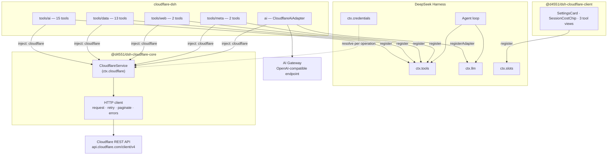
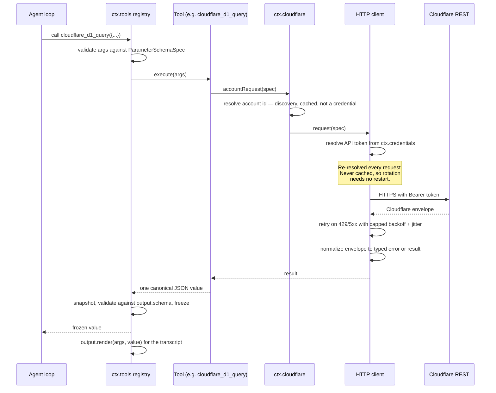
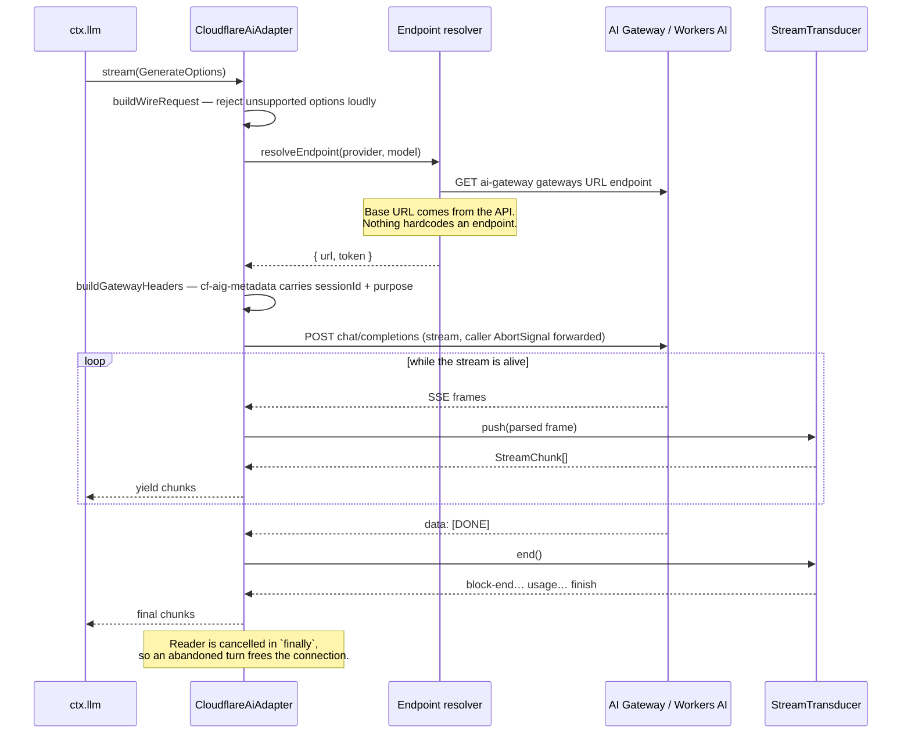
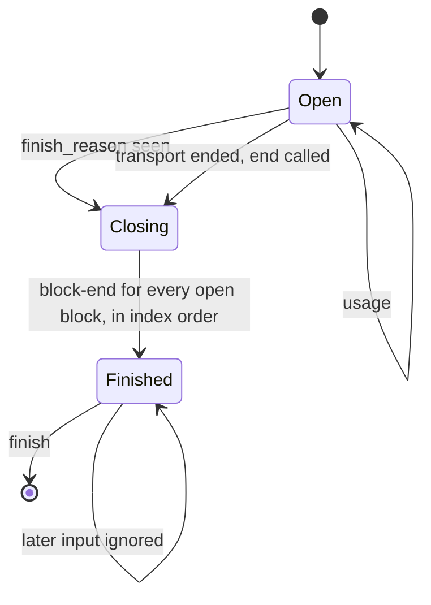
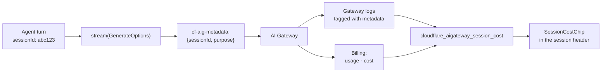
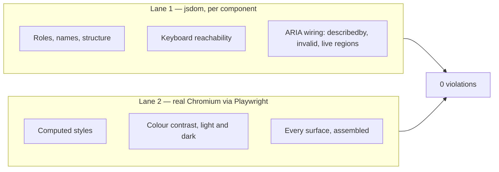
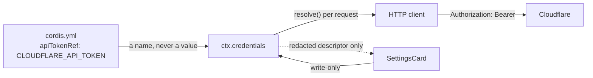

<div align="center">

# cloudflare-dsh

**Cloudflare tools, an AI Gateway model provider, and MCP passthrough for [DeepSeek Harness](https://github.com/deepseek-ai/deepseek-harness).**

[](https://github.com/d4551/cloudflare-dsh/actions/workflows/ci.yml)
[](#quality-gates)
[](#quality-gates)
[](#accessibility)
[](#accessibility)
[](tsconfig.base.json)
[](package.json)
[](LICENSE)

</div>

---

## Explain like I'm 5

Imagine you have a very capable assistant who can write and run code for you.
That assistant is **DeepSeek Harness** (DSH).

Now imagine you also rent a huge amount of internet plumbing from **Cloudflare**:
somewhere to keep files, somewhere to keep a database, a robot that can open web
pages for you, and a bank of GPUs that can run AI models.

Your assistant cannot touch any of that on its own. It does not know your
account exists.

**This project is the set of hands.** Install it, and three things happen:

1. **The assistant gets tools.** It can now say "put this in the database",
   "read that web page", "run this AI model" — 32 specific, typed actions
   instead of a vague "call an API somewhere".
2. **The assistant can think using Cloudflare's own AI.** Not just *call*
   Cloudflare models as a tool — actually *be powered by* them, routed through
   your AI Gateway.
3. **You get the receipts.** Every one of those thinking-requests is stamped
   with which conversation it came from. So when you ask "what did that
   conversation cost me?", there is a real answer from Cloudflare's billing
   data, not an estimate.

That third one is the interesting part, and it is the reason this project
exists rather than just being a list of API wrappers.

<details>
<summary><strong>The same thing, one level up</strong></summary>

DSH plugins are Cordis fibers. This repository ships a **bundle** — an npm
package declaring `dsh.bundle.patch`, which contributes a layer of rows to a
profile's plugin tree. One row provides a service (`ctx.cloudflare`); the others
consume it to register tools and one `LlmAdapter`.

The adapter is what makes session-level cost attribution possible: DSH passes
`sessionId` on every `GenerateOptions`, the adapter maps it into the
`cf-aig-metadata` header, and AI Gateway then reports usage and cost keyed by
that value. The correlation is exact, not inferred from timestamps.

</details>

---

## Contents

- [What you get](#what-you-get)
- [Install](#install)
- [Architecture](#architecture)
- [How a tool call flows](#how-a-tool-call-flows)
- [How a model call flows](#how-a-model-call-flows)
- [Per-session cost attribution](#per-session-cost-attribution)
- [Tool catalogue](#tool-catalogue)
- [The model provider](#the-model-provider)
- [Configuration](#configuration)
- [Web Client surfaces](#web-client-surfaces)
- [Accessibility](#accessibility)
- [MCP passthrough](#mcp-passthrough)
- [Security model](#security-model)
- [Quality gates](#quality-gates)
- [Development](#development)
- [Project status](#project-status)
- [Quality loop record](#quality-loop-record)
- [License](#license)

---

## What you get

| | |
|---|---|
| **32 tools** | Workers AI, AI Gateway, AI Search, Vectorize, KV, D1, Queues, R2, Browser Rendering, plus one bounded generic REST tool |
| **A model provider** | Two routes — `cloudflare-workers-ai` and `cloudflare-ai-gateway` — registered as a real `LlmAdapter`, streaming SSE into the harness chunk contract |
| **Session cost attribution** | `cf-aig-metadata` carries the harness session id and call purpose, so gateway logs and billing join to sessions exactly |
| **Web Client surfaces** | A settings card, a per-session usage chip, and three tool views, all WCAG 2.2 AA |
| **MCP passthrough** | Patch rows for Cloudflare's eight hosted MCP servers, off by default |

### Packages

| Package | Role |
|---|---|
| **`@d4551/dsh-cloudflare-core`** | The `ctx.cloudflare` capability seam — credential resolution, scoping, request construction, error normalization, pagination, retry |
| **`cloudflare-dsh`** | The bundle — four tool groups, the model provider, MCP rows, presets, and the `cordis.patch.yml` layer |
| **`@d4551/dsh-cloudflare-client`** | Web Client surfaces — settings card, session usage chip, tool views |

The three packages exist because they have genuinely different consumers.
Another bundle may want `ctx.cloudflare` without any of these tools; the client
package has its own build requirements (React, a client tsconfig, `dsh.client`)
that the headless packages must not inherit.

---

## Install

```sh
dsh plugin --profile <name> add cloudflare-dsh @d4551/dsh-cloudflare-core
```

Then supply the API token through the environment. The configuration names the
variable; it never holds the value:

```sh
export CLOUDFLARE_API_TOKEN=...
```

For the Web Client surfaces, also install the client package into the profile:

```sh
dsh plugin --profile <name> add @d4551/dsh-cloudflare-client
```

### API token scopes

Minimum permission groups for the shipped tools:

`Workers AI Read/Write` · `AI Gateway Read/Write` · `Vectorize Write` ·
`Workers KV Storage Write` · `D1 Write` · `Workers R2 Storage Write` ·
`Queues Write` · `Account Settings Read`

> [!NOTE]
> The Cloudflare dashboard labels these groups **Edit** where the API calls them
> **Write**. Use `Write` when minting a token through the API.

The account id is optional. Leave `accountId` empty and the first account the
token can reach is discovered once and reused.

---

## Architecture

The bundle is organised around a single capability seam. Everything that talks
to Cloudflare goes through `ctx.cloudflare`; everything else is a consumer of
it. That is what keeps credentials in one place, error handling in one place,
and the tool modules free of transport concerns.



### The capability seam

DSH's own convention is that a capability is complete only when all three roles
exist: a **service definition**, a **provider**, and a **consumer**. Here:

| Role | Where |
|---|---|
| Definition | `CloudflareService` class and its typed surface |
| Provider | `packages/core` — registers itself as `ctx.cloudflare` |
| Consumers | Every tool group and the model provider, via `inject: ['cloudflare']` |

### Why the pure/impure split

In `packages/core`, exactly one module dispatches a request: `client.ts`. The
service supplies the default `fetch` and nothing else there touches the network.
Everything else — path building, scope resolution, query serialization, error
mapping, pagination stepping, retry policy — is a pure function. The same is
true of the adapter: `transducer.ts` holds the entire streaming contract as a
state machine with no clock, no network and no randomness, and `adapter.ts` is
a thin shell around it.

This is not stylistic. It is what makes a 100% mutation score reachable
honestly: every branch that matters can be driven from a literal array of
fixture inputs, so a surviving mutant means a real gap rather than an
untestable seam.

---

## How a tool call flows



Two properties are worth calling out.

**The canonical value is a programmatic API.** DSH runs tools in PTC mode,
meaning generated code can call `await tools.cloudflare_kv_list_keys({...})` and
receive the value directly. So results carry ids and cursors that feed the next
call rather than prose a model has to parse. `cloudflare_kv_list_keys` returns
`{ keys, cursor, complete }` precisely so a generated loop can page.

**Presenters are pure.** `output.render` runs during session-log replay, so it
performs no I/O, reads no clock and uses no randomness.

---

## How a model call flows

The adapter's job is to turn one HTTP response into the harness's `StreamChunk`
sequence, honouring the ordering guarantees the harness depends on.



### Streaming contract

The transducer is where the contract lives, and it is enforced by construction
rather than convention:



| Obligation | How it holds |
|---|---|
| `usage` is emitted before `finish` | Both are produced by the same `push` call, in that order |
| Nothing follows `finish` | A `finished` flag makes every later `push`/`end` a no-op |
| Block indices allocated in first-seen order and reused | One allocator, one map keyed by wire index |
| Tool-call `arguments` stay raw JSON strings | Fragments accumulate as `argumentsDelta`, re-joined at `block-end`, never parsed |
| One adapter call is one provider attempt | No internal retry — the harness owns retry policy |
| `options.signal` is honoured | Forwarded to `fetch` unconditionally (`null` is the documented "no signal") |
| A quiet stream fails as a timeout | Every read races the configurable idle budget |
| Unsupported options fail loudly | Rejected before any request is issued |

---

## Per-session cost attribution

This is the feature the architecture is shaped around.



`GenerateOptions.purpose` is the bonus: DSH marks auxiliary calls as
`compaction` or `session-title`, so housekeeping is attributable separately from
real agent turns.

> [!IMPORTANT]
> The declarative path (`presets/pi-ai.yaml`, using the `llm-pi-ai` adapter DSH
> already ships) works on day one and costs nothing to adopt — but it cannot set
> `cf-aig-*` headers, so it gets no session correlation. That is the concrete
> reason this bundle ships a real adapter rather than only a preset.

---

## Tool catalogue

Tools are grouped into four modules, mounted as separate patch rows, so a
profile takes only the groups it wants.

### AI — `cloudflare-dsh/tools/ai` (15)

| Tool | Purpose |
|---|---|
| `cloudflare_ai_run` | Run any Workers AI model |
| `cloudflare_ai_models_search` | Search the model catalogue |
| `cloudflare_ai_model_schema` | Fetch a model's live JSON schema |
| `cloudflare_aigateway_list` / `_get` | Enumerate and inspect gateways |
| `cloudflare_aigateway_logs` | Page gateway request logs |
| `cloudflare_aigateway_log_body` | Fetch a logged request or response body |
| `cloudflare_aigateway_routes` | Dynamic routing configuration |
| `cloudflare_aigateway_cost` | Credit balance, usage history, invoice preview |
| `cloudflare_aigateway_session_cost` | Usage and cost for one harness session |
| `cloudflare_aisearch_search` / `_chat` / `_sync` | AI Search query, chat completion, index sync |
| `cloudflare_vectorize_index_list` / `_query` | Vector index listing and similarity query |

### Data — `cloudflare-dsh/tools/data` (13)

| Tool | Purpose |
|---|---|
| `cloudflare_kv_namespace_list` | List KV namespaces |
| `cloudflare_kv_list_keys` | Page keys — returns a cursor for PTC loops |
| `cloudflare_kv_get` / `_put` / `_delete` | Single-key value operations |
| `cloudflare_d1_list` | List D1 databases |
| `cloudflare_d1_query` | Parameterised SQL, multi-statement |
| `cloudflare_queue_list` / `_send` / `_pull` / `_ack` | Queue operations, lease-based |
| `cloudflare_r2_bucket_list` / `_create` | R2 bucket management |

### Web — `cloudflare-dsh/tools/web` (2)

| Tool | Purpose |
|---|---|
| `cloudflare_browser_render` | Markdown, screenshot, PDF, scrape, links, JSON, content |
| `cloudflare_browser_accessibility_tree` | The roles, names and structure a screen reader would expose for any URL |

`cloudflare_browser_accessibility_tree` is the standout: it hands an agent the
same tree an assistive technology would consume, which is exactly what a WCAG
review needs and what a screenshot cannot provide.

### Meta — `cloudflare-dsh/tools/meta` (2)

| Tool | Purpose |
|---|---|
| `cloudflare_account_list` | Account discovery |
| `cloudflare_api` | Bounded generic REST call for resources this bundle does not wrap |

---

## The model provider

Mounted as the `cloudflare-llm` row (`cloudflare-dsh/ai`), registering two
routes:

| Route | Endpoint | Notes |
|---|---|---|
| `cloudflare-workers-ai` | The account's OpenAI-compatible Workers AI path | Works with defaults |
| `cloudflare-ai-gateway` | Base URL resolved from the gateway URL endpoint | Needs `gatewayId`; says so loudly if missing |

Registration is inert until a session selects one of the routes, so mounting the
row costs nothing.

### Error mapping

Provider failures are mapped onto the harness's canonical vocabulary rather than
surfaced raw:

| Signal | Code |
|---|---|
| Context/token-length error text | `CONTEXT_WINDOW_EXCEEDED` |
| Quota exhausted | `QUOTA_EXCEEDED` |
| HTTP 429 | `RATE_LIMIT` |
| Idle beyond `streamIdleTimeoutMs` | `TIMEOUT` |
| Completion with no content blocks | `EMPTY_RESPONSE` |
| Any option the wire format cannot express | `UNSUPPORTED_OPTION` |
| Anything else from the provider | `PROVIDER_ERROR` |

---

## Configuration

Every deployment-varying value is a validated Schemastery field, changeable from
`cordis.yml` without a code edit. There are no tunables hidden as constants.

> [!WARNING]
> A patch layer **replaces** a row's entire `config` value rather than merging
> into it. That is why each row's configuration is small and local: overriding
> one key never forces you to restate the rest.

### `cloudflare` — the seam (`@d4551/dsh-cloudflare-core`)

| Field | Default | Meaning |
|---|---|---|
| `apiTokenRef` | `CLOUDFLARE_API_TOKEN` | Credential reference — a POSIX env-var **name**, never a value |
| `accountId` | `''` | Account to operate on; discovered at first use when empty |
| `baseUrl` | `https://api.cloudflare.com/client/v4` | REST root; overridable for API-compatible proxies |
| `requestTimeoutMs` | `30000` | Per-request timeout |
| `maxRetries` | `3` | Retry budget for transient failures |
| `retryBaseDelayMs` | `250` | First backoff step |
| `retryMaxDelayMs` | `10000` | Backoff ceiling, and the cap applied to a server `Retry-After` |
| `maxPages` | `100` | Hard ceiling on pages walked by one list call |

### `cloudflare-llm` — the model provider (`cloudflare-dsh/ai`)

| Field | Default | Meaning |
|---|---|---|
| `gatewayId` | `''` | Gateway to route through; required for the gateway route |
| `gatewayProvider` | `workers-ai` | Provider slug the gateway forwards to |
| `chatCompletionsPath` | `/chat/completions` | Path appended to the resolved base URL |
| `workersAiPath` | `/ai/v1/chat/completions` | OpenAI-compatible Workers AI path, relative to the account scope |
| `cacheTtlSeconds` | `0` | `cf-aig-cache-ttl` |
| `skipCache` | `false` | `cf-aig-skip-cache` |
| `collectLog` | `true` | `cf-aig-collect-log` — required for session cost attribution |
| `tags` | `{}` | Static tags merged into `cf-aig-metadata` |
| `streamIdleTimeoutMs` | `300000` | How long a stream may go quiet before failing as a timeout |
| `models` | `[]` | Advertised models; empty means query the catalogue |

### `cloudflare-tools-meta` — the escape hatch (`cloudflare-dsh/tools/meta`)

| Field | Default | Meaning |
|---|---|---|
| `allowMutations` | `false` | When false, `cloudflare_api` rejects anything but `GET`/`HEAD` |
| `denyPathPrefixes` | `[]` | Path prefixes `cloudflare_api` refuses outright |

### The shipped patch layer

```yaml
- insert:
    - id: cloudflare
      name: '@d4551/dsh-cloudflare-core'
      config:
        apiTokenRef: CLOUDFLARE_API_TOKEN
    - id: cloudflare-tools-ai
      name: 'cloudflare-dsh/tools/ai'
    - id: cloudflare-tools-data
      name: 'cloudflare-dsh/tools/data'
    - id: cloudflare-tools-web
      name: 'cloudflare-dsh/tools/web'
    - id: cloudflare-llm
      name: 'cloudflare-dsh/ai'
    - id: cloudflare-tools-meta
      name: 'cloudflare-dsh/tools/meta'
      config:
        allowMutations: false
        denyPathPrefixes: []
```

---

## Web Client surfaces

`@d4551/dsh-cloudflare-client` contributes to three slots. Components never
receive `ctx`; they take props.

| Component | Slot | What it shows |
|---|---|---|
| `SettingsCard` | `settings.plugin.cloudflare` | Credential reference, account and gateway selection. Write-only for secrets |
| `SessionCostChip` | `conversation.session.header.actions` | This session's requests, cost, cache hit rate and token counts |
| `D1Result` | `tool.call.toolview` → `cloudflare_d1_query` | A real table with column headers and a caption naming the query |
| `BrowserRender` | `tool.call.toolview` → `cloudflare_browser_render` | Rendered output, with meaningful alternative text for screenshots |
| `AccessibilityTree` | `tool.call.toolview` → `cloudflare_browser_accessibility_tree` | The tree as nested lists rather than a flat dump |

The package ships `cloudflare.css`. Colours are CSS custom properties, so a
host's theme wins wherever it defines them.

All user-facing copy routes through a typed dictionary in `locales/en.ts`,
including accessible names — those are part of the interface, not decoration.

---

## Accessibility

Upstream DSH ships no accessibility guidance for plugin authors. This project
sets its own bar: **WCAG 2.2 AA, zero axe violations, enforced in CI**.

Accessibility runs in two lanes because one is not enough:



The split exists for a measured reason: axe-core's colour-contrast rule cannot
run under jsdom ([axe-core#595](https://github.com/dequelabs/axe-core/issues/595))
because it needs computed styles. Components that pass in isolation can still
conflict once composed, so the assembled client gets its own scan in both colour
schemes.

**Neither lane filters axe.** No tag scope, no disabled rules, no excluded
selectors. The Chromium fixture supplies the landmarks, page heading and chrome
colours a host would provide, so page-scoped rules fail on a real defect rather
than on an unrealistic harness.

Specific commitments, covered by tests:

- Every input has a programmatic label; secret fields are `type=password` with
  `autocomplete=off`.
- Errors are wired with `aria-describedby` and announced in a live region
  (SC 3.3.1, 4.1.3); the region stays mounted and empty until it has something
  to say.
- Status messages land in a polite `role="status"` region.
- Tables are real tables with header cells and a caption naming the query.
- Scroll containers are keyboard-reachable and named.
- Screenshots carry meaningful alternative text.

---

## MCP passthrough

`cloudflare-dsh/mcp` exports patch rows for Cloudflare's eight hosted MCP
servers: docs, bindings, observability, radar, browser, AI Gateway, AutoRAG and
Logpush.

**Nothing ships enabled.** Each server is a remote endpoint reached outside the
agent sandbox, so turning one on is a deliberate act by whoever owns the
profile. Authentication is browser OAuth, which makes these useful in an
interactive profile and unsuitable for headless runs.

Only tools are bridged — MCP resources and prompts are not. Bridged tools appear
as `mcp__<serverName>__<toolName>`.

---

## Security model

### Credentials



- The token is **re-resolved on every request** and never cached, so rotation
  takes effect without a restart.
- Configuration and patch YAML hold the reference **name**, never the secret.
- Error messages name the reference, never the value.
- The settings UI is write-only: it can set a credential and learn *whether* one
  is stored, never read it back.

### The escape hatch is bounded

`cloudflare_api` exists so the ~70 Cloudflare resources this bundle does not
wrap stay reachable. It is a bounded capability, not a bypass:

1. **Read-only by default.** `allowMutations` is `false`, and anything but
   `GET`/`HEAD` is rejected at the schema level.
2. **Path denylist.** `denyPathPrefixes` refuses matching paths outright.
3. **Validated, not concatenated.** No `..`, no absolute URLs, no host
   override — it cannot leave the REST root or reach another host.

---

## Quality gates

**No overrides, exceptions or justifications.** Not in a config, not in a
comment, not in a pull request body. A gate either passes on the code as
written, or the code changes.

Every rule below is **asserted by `bun run test:invariants`**, which runs in CI.
A rule that is only documented holds until someone edits a config and nothing
goes red; these fail a build instead.

| Rule | What fails if it stops being true |
|---|---|
| No mutation-score slack | `stryker.config.json` sets `break: 100`, and the invariants suite asserts the threshold |
| No file escapes mutation | `mutate` is two positive globs with **no** negated pattern, `scripts/verify-mutation-files.mjs` fails the run if a file that emits JavaScript produced no mutants, and the invariants suite asserts both the globs and that the guard is wired into the `stryker` script |
| No const assertions in source | Stryker does not mutate inside `as const`; the invariants suite rejects one anywhere under `packages/*/src` |
| No coverage slack | Vitest thresholds are 100 on every metric, asserted |
| No suppression comments | No `eslint-disable`, `oxlint-disable`, `@ts-ignore`, `@ts-expect-error`, `@ts-nocheck` or `Stryker disable` in any tracked code file, asserted |
| No softened lint severity | Every enabled `oxlint` category is graded `error` and the script carries `--deny-warnings`, asserted |
| No skipped type checking | `strict`, `noUncheckedIndexedAccess` and `exactOptionalPropertyTypes` on, `skipLibCheck` off, asserted |
| No hidden files | `knip`'s root workspace scope is asserted non-empty |
| No axe filtering | No tag scope, rule disabling, selector exclusion or inline rule override in any test, asserted, plus a positive assertion that the unfiltered scan is the one that runs |
| No skipped tests | No `.skip`, `.only`, `.todo`, conditional skip or soft assertion in any test file, asserted |
| No gate quietly dropped from CI | Every gate command is asserted present in the workflow |

Each of those assertions was verified by breaking the thing it guards and
watching the suite go red — a gate nobody has seen fail is not known to work.

A surviving mutant means the code is untested or dead: write the test or delete
the code. A lint rule that fires means the code changes, not that the rule gets
silenced.

### The pipeline

```mermaid
graph LR
    A["typecheck<br/>tsc strict"] --> B["lint<br/>oxlint --deny-warnings"]
    B --> B2["test:invariants<br/>the rules, as assertions"]
    B2 --> C["test:coverage<br/>100% thresholds"]
    C --> D["build<br/>tsdown"]
    D --> E["test:dist<br/>built artifacts"]
    E --> F["test:a11y<br/>Chromium + axe"]
    F --> G["stryker<br/>break: 100"]
    G --> H["verify-mutation-files<br/>no file escaped"]
    H --> I["knip + publint"]
```



### Toolchain notes

**Tests run on Vitest under Node, not `bun test`.** Two reasons: Stryker has no
official Bun runner, and DSH executes plugins on Node — testing on Bun's runtime
would validate a runtime production never uses. Bun remains the package manager,
workspace and script runner.

**Vitest is pinned to 4.x** for a specific upstream bug, not a vague
incompatibility. On Vitest 5 the Stryker vitest runner's per-test name filter
matches nothing, so every covered mutant is reported as surviving
([stryker-js#6210](https://github.com/stryker-mutator/stryker-js/issues/6210):
Vitest 5 joins the describe/test chain with `' > '`). Measured when the pin was
chosen: the same suite scored 1.19% on Vitest 5.0.0 and 100% on 4.1.11. The
behaviour is deterministic, not flaky. Unpin and re-measure once the issue is
fixed.

---

## Development

```sh
bun install
```

| Script | What it does |
|---|---|
| `bun run typecheck` | `tsc -b`, strict, `skipLibCheck: false` |
| `bun run lint` | `oxlint --deny-warnings .` |
| `bun run test` | Vitest on Node |
| `bun run test:coverage` | The same, with 100% thresholds |
| `bun run test:invariants` | Asserts every rule in [Quality gates](#quality-gates) |
| `bun run test:a11y` | Real Chromium, both colour schemes, axe unfiltered |
| `bun run build` | `tsdown`, per package |
| `bun run test:dist` | Loads the **built** artifacts as a consumer resolves them |
| `bun run stryker` | Mutation testing, then the escape guard |
| `bun run knip` | Unused files, exports and dependencies |
| `bun run publint` | Package publishing sanity, all three packages |

### Repository layout

```
packages/
  core/     @d4551/dsh-cloudflare-core   — the ctx.cloudflare seam
    src/    client.ts is the only module that performs I/O;
            config, credentials, errors, paginate, request, retry, scope are pure
  bundle/   cloudflare-dsh               — the bundle
    src/ai/     adapter, transducer, sse, headers, request, errors
    src/tools/  ai, data, web, meta
    src/specs/  request specifications, separated from tool wiring
    src/mcp/    hosted MCP server rows
    presets/    pi-ai.yaml — the zero-code declarative path
    cordis.patch.yml
  client/   @d4551/dsh-cloudflare-client — Web Client surfaces
scripts/    verify-mutation-files.mjs
tests/      dist.test.ts       — the built-output suite
            invariants.test.ts — the quality rules, as assertions
```

`test:dist` deliberately has no source aliases. The unit and accessibility
suites reach `src` through a path alias; this one resolves the packages the way
a consumer would, and rejects a `workspace:` range surviving into a published
manifest.

---

## Project status

Pre-1.0, tracking a pre-stable harness. DSH itself is a developer preview whose
own documentation warns of compatibility-breaking changes, so DSH dependencies
are pinned to exact versions rather than ranges.

### What is verified, and how

| Claim | Evidence |
|---|---|
| The bundle composes into a real profile | `@deepseek-ai/dsh` installed, both packages packed and installed into a scratch profile, `dsh --profile <name> --dump-config` prints all six rows as shipped |
| The published artifacts load | `test:dist` resolves each export the way Node does and requires the file on disk |
| Every subpath the patch names is exported | Same suite, driven from `cordis.patch.yml` |
| No `workspace:` range reaches a published manifest | Same suite |
| The streaming contract holds | The transducer is exercised exhaustively from fixture event arrays; a recorded SSE session replays to an exact `StreamChunk[]` |
| Accessibility | axe in real Chromium, both colour schemes, no filtering |

### What is *not* claimed

- **Driving the tools from a live agent session.** That needs a DeepSeek API key
  and Cloudflare credentials, so it has not been executed here.
- **Module resolution via `--dump-config`.** That command reads configuration
  without loading plugins — measured by inserting a deliberately unresolvable
  specifier and watching it print and exit 0. Resolution is `test:dist`'s job.
- **Request and response body schemas.** Cloudflare's paths, methods and SDK
  namespaces were ground-truthed against upstream sources; body shapes are
  modelled and will be corrected against recorded fixtures on first live call.
- **Publication to npm.** The packages build and pack cleanly; publishing is a
  human decision.

---

## Quality loop record

This project runs an adversarial audit against its own gates. When the audit
finds a gate passing for the wrong reason, the loop restarts, the counter goes
up, and the defect is fixed at its root rather than reworded.

**I'm a fucking loser: 4**

<details>
<summary><strong>Restart 1 — the mutation glob matched less than the claim</strong></summary>

The Stryker `mutate` glob was `packages/*/src/**/*.ts`, which does not match
`.tsx`. All five React components were therefore never mutated, while the README
and commit messages claimed a 100% mutation score "across all three packages" —
32 of 37 files were instrumented.

Fixed by mutating `.tsx` as well and earning the score back, not by rewording
the claim. The six survivors it exposed were fixed by writing the assertions
that had been missing and deleting one dead condition.

</details>

<details>
<summary><strong>Restart 2 — four claims that had not been measured</strong></summary>

- **"Lint clean" was read off an exit code.** `oxlint` was emitting 16 warnings
  and exiting 0, because the config graded two categories as warnings. Fixed by
  fixing all 16 and running the gate with `--deny-warnings`.
- **`workspace:*` in the bundle's published dependencies.** Nobody installing
  from the registry could have resolved it. `publint` did not catch it and no
  test looked. A test now rejects any `workspace:` range in a published
  manifest.
- **Nothing had ever exercised the built output.** Every suite ran against `src`
  through a path alias, so "publishes prebuilt" was unverified. `test:dist` now
  loads each built entry point the way a consumer resolves it.
- **Plan phases were marked done against exit criteria never executed.** Phase 0
  required `dsh --dump-config` to show our rows in a real profile. That had never
  been run. It has now.

</details>

<details>
<summary><strong>Restart 3 — eleven defects, and the rule made absolute</strong></summary>

An adversarial audit reported a violation and, by design, would not say which.
The response was to make the rule absolute — no overrides, exceptions or
justifications anywhere — and re-audit the tree against it.

1. **The mutation gate narrowed itself while the README denied it.** `mutate`
   carried a negated pattern two paragraphs under a sentence promising no
   `mutate` narrowing, and `break` was 99 while commits claimed 100.
2. **"Lint clean" was still being bought with suppression comments.** Four
   `eslint-disable-next-line no-await-in-loop` directives silenced a rule that
   genuinely fired. Deleting them turned the gate red, which is what an honest
   gate does. The three sites were restructured instead — recursion in
   `runWithRetry`, a flat async iterator in `paginate` and in the adapter's read
   loop — so one request is one `await` in one call.
3. **Two lint categories were graded `warn`** rather than `error`.
4. **`skipLibCheck` was on.** The errors it hid were an undeclared peer,
   `@deepseek-ai/dsh-attachment`, which this package's published types resolve
   through. Now declared, so a consumer's typecheck resolves too.
5. **`knip` was told the root workspace held no files** (`project: []`), so
   nothing at the repository root was ever checked.
6. **Coverage thresholds were 99 against a measured 100.**
7. **A double cast** (`as unknown as`) defeated type checking in
   `cloudflare_account_list`. Replaced with an explicit projection, which is the
   right shape anyway: under PTC the canonical value is a programmatic API.
8. **Two assertions in the built-output suite proved less than they read as** —
   `toBeGreaterThanOrEqual(5)` on the patch's rows, and `toBeDefined()` on an
   export key that was never resolved to a file.
9. **The model provider was never mounted.** `cordis.patch.yml` listed the seam
   and four tool groups but not `cloudflare-dsh/ai`, so the adapter — the whole
   reason the session-correlation design exists — could not activate in any
   profile that installed the bundle.
10. **The real-harness section claimed more than the command proves.** It said
    `--dump-config` showed that specifiers resolve and defaults apply. Neither
    follows, which was settled by inserting a deliberately unresolvable
    specifier and watching it print and exit 0.
11. **A `const` assertion was hiding a whole file from mutation.**
    `locales/en.ts` ended in `} as const`, and Stryker does not mutate inside a
    const assertion — so the file produced zero mutants and was omitted from the
    report entirely. Removing the assertion exposed 47 mutants, **ten of them
    surviving**: user-facing copy nothing asserted. The cause was
    self-referential assertions — tests compared rendered output against the
    same dictionary entry that produced it. Those assertions now pin the literal
    copy, every `as const` in `src` is gone, and
    `scripts/verify-mutation-files.mjs` makes the escape impossible to repeat
    silently.

</details>

<details>
<summary><strong>Restart 4 — rules that nothing enforced</strong></summary>

The audit found a violation and, by design, would not say which. It did say
what class it belonged to: not a red gate, but "a claim standing for the wrong
reason", and that the remedy is that *a claim not enforced by something that
fails gets deleted or gets enforcement*.

Applying that test to this repository's own quality section produced an
uncomfortable answer. Nine of its eleven rules were enforced by nothing at all.
"No suppression comments", "no skipped tests", "no axe filtering", "no softened
lint severity", "no skipped type checking", "no hidden files" — every one of
those was a sentence in a document. Adding an `eslint-disable`, a `.skip`, a
`disableRules`, or flipping `skipLibCheck` back on would have kept every gate
green and every badge accurate-looking. The two rules that *were* enforced
(the mutation threshold and the file-escape guard) had only become so during
the previous two restarts, each time after the unenforced version had already
failed.

One further claim was simply false: the Restart 1 entry said the fix reached
"37/37" instrumented files. It did not — `locales/en.ts` was still escaping
behind a const assertion, which is what Restart 3 eventually found. The number
was reported from a tool output that omitted the escaped file, which is exactly
how the escape stayed invisible.

Fixed by writing `tests/invariants.test.ts`, a lane of its own that runs in CI
and asserts every rule the section states: the Stryker globs and threshold, the
guard being wired into the script, no const assertion under `src`, the coverage
thresholds, the absence of every suppression and evasion form in tracked code,
the lint severities and `--deny-warnings`, the four strictness options, knip's
root scope, the absence of every axe-weakening API alongside a positive
assertion that the unfiltered scan is the one that runs, and the presence of
every gate command in the workflow.

Each assertion was then verified the only way an assertion can be: by breaking
the thing it guards and watching the suite go red. Eight softenings were applied
one at a time — threshold to 99, `skipLibCheck` on, a category downgraded to
`warn`, knip's root scope narrowed, a suppression comment added to a source
file, a const assertion added to a source file, the mutation step deleted from
CI, `--deny-warnings` dropped — and each produced a failing test before the tree
was restored.

The needles the suite scans for are assembled from string fragments, so the file
does not contain the text it forbids and needs no exemption for itself.

</details>

---

## License

MIT — see [LICENSE](LICENSE).
