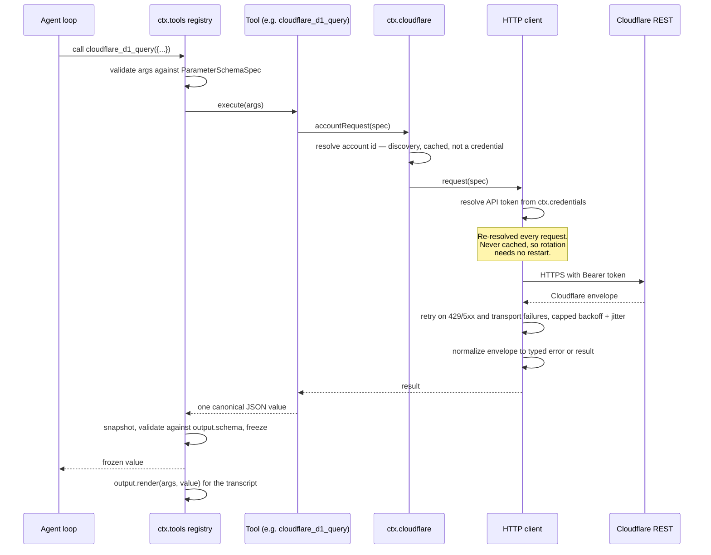
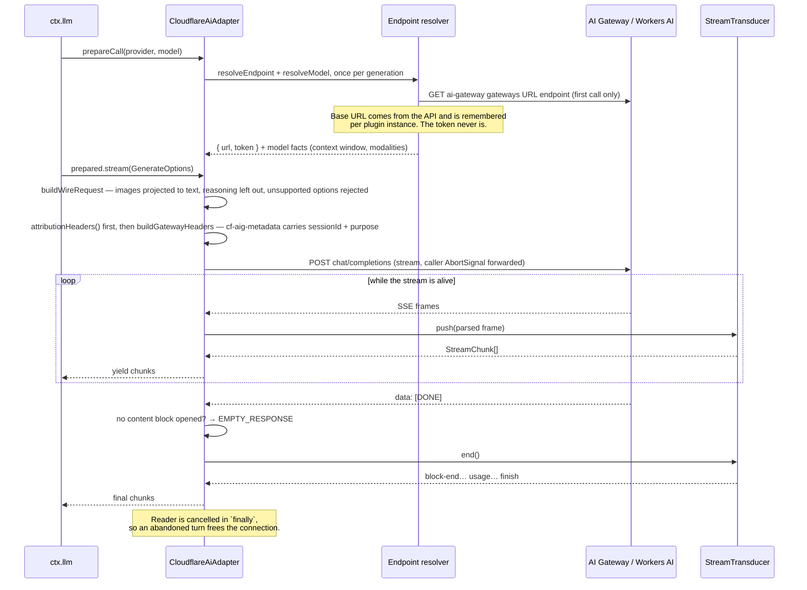
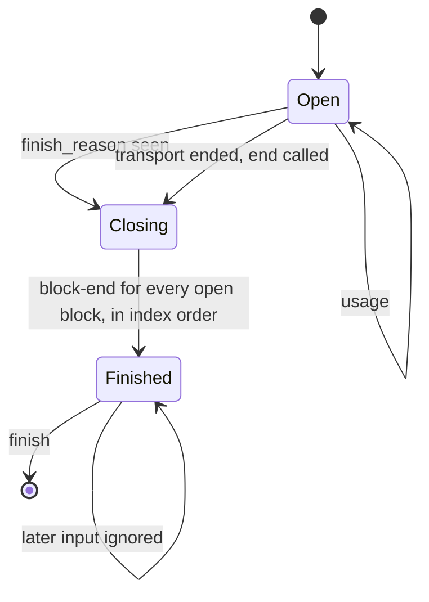
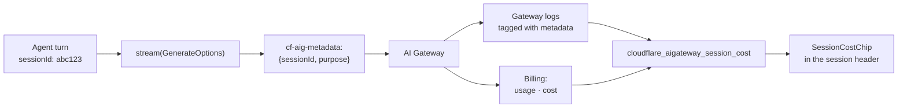
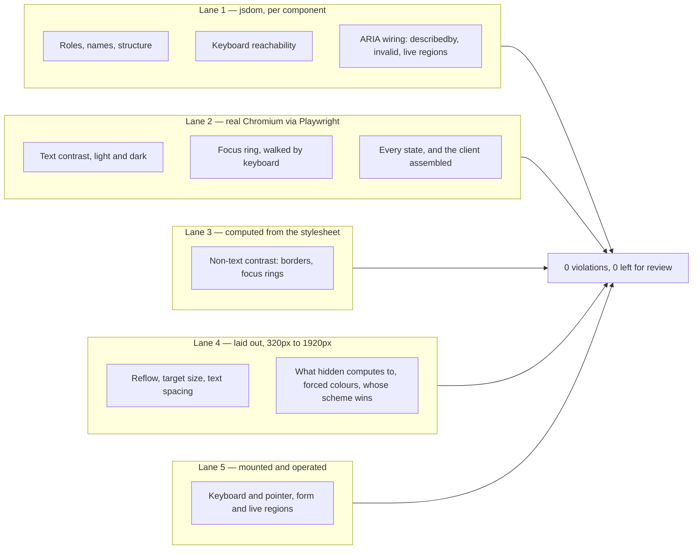
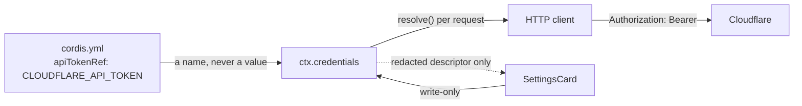

<div align="center">

# cloudflare-dsh

**Cloudflare tools, an AI Gateway model provider, and MCP passthrough for [DeepSeek Harness](https://github.com/deepseek-ai/deepseek-harness).**

[](https://github.com/d4551/cloudflare-dsh/actions/workflows/ci.yml)
[](#quality)
[](#quality)
[](#accessibility)
[](#accessibility)
[](tsconfig.base.json)
[](package.json)
[](LICENSE)

</div>

---

## Explain like I'm 5

Imagine you have a very capable assistant who can write and run code for you.
That assistant is **DeepSeek Harness** (DSH).

Now imagine you also rent a huge amount of internet plumbing from **Cloudflare**:
somewhere to keep files, somewhere to keep a database, a robot that can open web
pages for you, and a bank of GPUs that can run AI models.

Your assistant cannot touch any of that on its own. It does not know your
account exists.

**This project is the set of hands.** Install it, and three things happen:

1. **The assistant gets tools.** It can now say "put this in the database",
   "read that web page", "run this AI model" — 36 specific, typed actions
   instead of a vague "call an API somewhere".
2. **The assistant can think using Cloudflare's own AI.** Not just _call_
   Cloudflare models as a tool — actually _be powered by_ them, routed through
   your AI Gateway.
3. **You get the receipts.** Every one of those thinking-requests is stamped
   with which conversation it came from. So when you ask "what did that
   conversation cost me?", there is a real answer from Cloudflare's billing
   data, not an estimate.

That third one is the interesting part, and it is the reason this project
exists rather than just being a list of API wrappers.

<details>
<summary><strong>The same thing, one level up</strong></summary>

DSH plugins are Cordis fibers. This repository ships a **bundle** — an npm
package declaring `dsh.bundle.patch`, which contributes a layer of rows to a
profile's plugin tree. One row provides a service (`ctx.cloudflare`); the others
consume it to register tools and one `LlmAdapter`.

The adapter is what makes session-level cost attribution possible: DSH passes
`sessionId` on every `GenerateOptions`, the adapter maps it into the
`cf-aig-metadata` header, and AI Gateway then reports usage and cost keyed by
that value. The correlation is exact, not inferred from timestamps.

</details>

---

## Contents

- [What you get](#what-you-get)
- [Install](#install)
- [Architecture](#architecture)
- [How a tool call flows](#how-a-tool-call-flows)
- [How a model call flows](#how-a-model-call-flows)
- [Per-session cost attribution](#per-session-cost-attribution)
- [Tool catalogue](#tool-catalogue)
- [The model provider](#the-model-provider)
- [Configuration](#configuration)
- [Web Client surfaces](#web-client-surfaces)
- [Accessibility](#accessibility)
- [MCP passthrough](#mcp-passthrough)
- [Security model](#security-model)
- [Quality](#quality)
- [Development](#development)
- [Project status](#project-status)
- [License](#license)

---

## What you get

|                              |                                                                                                                                                     |
| ---------------------------- | --------------------------------------------------------------------------------------------------------------------------------------------------- |
| **36 tools**                 | Workers AI, AI Gateway, AI Search, Vectorize, KV, D1, Queues, R2, Browser Rendering, plus one bounded generic REST tool                             |
| **A model provider**         | Two routes — `cloudflare-workers-ai` and `cloudflare-ai-gateway` — registered as a real `LlmAdapter`, streaming SSE into the harness chunk contract |
| **Session cost attribution** | `cf-aig-metadata` carries the harness session id and call purpose, so gateway logs and billing join to sessions exactly                             |
| **Web Client surfaces**      | A settings card, a per-session usage chip, and three tool views, all WCAG 2.2 AA                                                                    |
| **MCP passthrough**          | Patch rows for Cloudflare's eight hosted MCP servers, off by default                                                                                |

### Packages

| Package                            | Role                                                                                                                                |
| ---------------------------------- | ----------------------------------------------------------------------------------------------------------------------------------- |
| **`@d4551/dsh-cloudflare-core`**   | The `ctx.cloudflare` capability seam — credential resolution, scoping, request construction, error normalization, pagination, retry |
| **`cloudflare-dsh`**               | The bundle — four tool groups, the model provider, MCP rows, presets, and the `cordis.patch.yml` layer                              |
| **`@d4551/dsh-cloudflare-client`** | Web Client surfaces — settings card, session usage chip, tool views                                                                 |

The three packages exist because they have genuinely different consumers.
Another bundle may want `ctx.cloudflare` without any of these tools; the client
package has its own build requirements (React, a client tsconfig, `dsh.client`)
that the headless packages must not inherit.

---

## Install

```sh
dsh plugin --profile <name> add cloudflare-dsh @d4551/dsh-cloudflare-core
```

Then supply the API token through the environment. The configuration names the
variable; it never holds the value:

```sh
export CLOUDFLARE_API_TOKEN=...
```

For the Web Client surfaces, also install the client package into the profile:

```sh
dsh plugin --profile <name> add @d4551/dsh-cloudflare-client
```

### API token scopes

Minimum permission groups for the shipped tools:

`Workers AI Read/Write` · `AI Gateway Read/Write` · `Vectorize Write` ·
`Workers KV Storage Write` · `D1 Write` · `Workers R2 Storage Write` ·
`Queues Write` · `Account Settings Read`

> [!NOTE]
> The Cloudflare dashboard labels these groups **Edit** where the API calls them
> **Write**. Use `Write` when minting a token through the API.

The account id is optional when the token can reach exactly one account: it is
discovered once and reused. A token that can reach several makes discovery
ambiguous, so the plugin refuses to guess and asks for `accountId`, naming the
accounts it saw.

---

## Architecture

The bundle is organised around a single capability seam. Everything that talks
to Cloudflare goes through `ctx.cloudflare`; everything else is a consumer of
it. That is what keeps credentials in one place, error handling in one place,
and the tool modules free of transport concerns.


### The capability seam

DSH's own convention is that a capability is complete only when all three roles
exist: a **service definition**, a **provider**, and a **consumer**. Here:

| Role       | Where                                                                 |
| ---------- | --------------------------------------------------------------------- |
| Definition | `CloudflareService` class and its typed surface                       |
| Provider   | `packages/core` — registers itself as `ctx.cloudflare`                |
| Consumers  | Every tool group and the model provider, via `inject: ['cloudflare']` |

### Why the pure/impure split

In `packages/core`, exactly one module dispatches a request: `client.ts`. The
service supplies the default `fetch` and nothing else there touches the network.
Everything else — path building, scope resolution, query serialization, error
mapping, pagination stepping, retry policy — is a pure function. The same is
true of the adapter: `transducer.ts` holds the entire streaming contract as a
state machine with no clock, no network and no randomness, and `adapter.ts` is
a thin shell around it.

This is not stylistic. It is what makes a 100% mutation score reachable
honestly: every branch that matters can be driven from a literal array of
fixture inputs, so a surviving mutant means a real gap rather than an
untestable seam.

### What one request can carry

Cloudflare's REST surface is not uniformly JSON, so a `RequestSpec` says how it
is read and how it is written, and the client does exactly that.

| Direction | Shapes                                                                                                                                                                    |
| --------- | ------------------------------------------------------------------------------------------------------------------------------------------------------------------------- |
| Read      | The envelope (`request`, `requestEnvelope`); raw text, for a KV value (`requestText`); bytes with the media type the server declared, for a screenshot (`requestBytes`)   |
| Write     | A `body` the client serializes as JSON; or an `encodedBody` the caller already encoded, sent verbatim under its own media type — Vectorize's writes take NDJSON, not JSON |

`accept` names what the caller can read, so an endpoint that answers with an
image is asked for an image. Every one of these paths goes through the same
retry policy and the same failure classification: an error body is read as an
envelope when the endpoint sends one, whatever the successful shape would be.

---

## How a tool call flows



Two properties are worth calling out.

**The canonical value is a programmatic API.** DSH runs tools in PTC mode,
meaning generated code can call `await tools.cloudflare_kv_list_keys({...})` and
receive the value directly. So results carry ids and cursors that feed the next
call rather than prose a model has to parse. `cloudflare_kv_list_keys` returns
`{ keys, cursor, complete }` precisely so a generated loop can page, and every
list tool pages the way its endpoint does: page-numbered endpoints take `page`
and `perPage` and return `page`, `perPage`, `total` (when Cloudflare reports
one, else `null`) and `complete`; cursor endpoints (`cloudflare_kv_list_keys`,
`cloudflare_r2_bucket_list`) return `cursor` and `complete`; and
`cloudflare_queue_list`, whose endpoint takes no paging parameters, returns the
whole listing and says if the API reported more than it returned. Every tool
declares a closed output object with each field described and required; the
registry validates a value against it before the model or generated code sees
it, and a presenter reads typed fields rather than casting.

**Presenters are pure.** `output.render` runs during session-log replay, so it
performs no I/O, reads no clock and uses no randomness.

**Cancellation reaches Cloudflare.** `timeoutMs` on a tool is declarative — the
registry does not interrupt a body — so every tool forwards `exec.signal` into
its request, and a tool with a budget of its own (`inferenceTimeoutMs`,
`renderTimeoutMs`) makes that budget the request deadline as well, so a 120 s
inference is not cut off by the 30 s client default.

---

## How a model call flows

The adapter's job is to turn one HTTP response into the harness's `StreamChunk`
sequence, honouring the ordering guarantees the harness depends on.



### Streaming contract

The transducer is where the contract lives, and it is enforced by construction
rather than convention:



| Obligation                                             | How it holds                                                                                                                                                                                                                          |
| ------------------------------------------------------ | ------------------------------------------------------------------------------------------------------------------------------------------------------------------------------------------------------------------------------------- |
| `usage` is emitted before `finish`                     | The finish reason closes the blocks but is held back until the stream ends, so a provider that reports usage in a trailing chunk — the shape `stream_options.include_usage` produces — is still observed, and `finish` is always last |
| Nothing follows `finish`                               | A `finished` flag makes every later `push`/`end` a no-op                                                                                                                                                                              |
| Block indices allocated in first-seen order and reused | One allocator, one map keyed by wire index                                                                                                                                                                                            |
| Tool-call `arguments` stay raw JSON strings            | Fragments accumulate as `argumentsDelta`, re-joined at `block-end`, never parsed                                                                                                                                                      |
| One adapter call is one provider attempt               | No internal retry — the harness owns retry policy                                                                                                                                                                                     |
| `options.signal` is honoured                           | Forwarded to `fetch` unconditionally (`null` is the documented "no signal")                                                                                                                                                           |
| A quiet stream fails as a timeout                      | Every read races the configurable idle budget                                                                                                                                                                                         |
| Unsupported options fail loudly                        | Rejected before any request is issued                                                                                                                                                                                                 |
| Every provider request carries attribution             | `attributionHeaders()` is the first thing set on the request; nothing after it can replace the header                                                                                                                                 |
| A completion with no content is a failure              | `EMPTY_RESPONSE`, whether it ended with a finish reason, the `[DONE]` sentinel, or the socket; usage alone is not content                                                                                                             |
| Every finish reason has a meaning                      | `stop`, `tool_calls` and `length` map to the harness kinds; `content_filter` and anything unknown are an `error` finish naming the reason                                                                                             |
| Every content block has a stated fate                  | Text is sent; tool calls and results round-trip, text beside results included; images become the harness's text through its own helper; reasoning is left out, as OpenAI-compatible reasoning APIs refuse it in input                 |
| A tool call always has an id                           | The provider's when it sends one; a deterministic `call_<index>` when it never does, since an empty id cannot be correlated with its result                                                                                           |

---

## Per-session cost attribution

This is the feature the architecture is shaped around.



`GenerateOptions.purpose` is the bonus: DSH marks auxiliary calls as
`compaction` or `session-title`, so housekeeping is attributable separately from
real agent turns.

> [!IMPORTANT]
> The declarative path (`presets/pi-ai.yaml`, using the `llm-pi-ai` adapter DSH
> already ships) works on day one and costs nothing to adopt — but it cannot set
> `cf-aig-*` headers, so it gets no session correlation. That is the concrete
> reason this bundle ships a real adapter rather than only a preset.

---

## Tool catalogue

Tools are grouped into four modules, mounted as separate patch rows, so a
profile takes only the groups it wants.

### AI — `cloudflare-dsh/tools/ai` (18)

| Tool                                                                                   | Purpose                                         |
| -------------------------------------------------------------------------------------- | ----------------------------------------------- |
| `cloudflare_ai_run`                                                                    | Run any Workers AI model, one complete response |
| `cloudflare_ai_models_search`                                                          | Search the model catalogue                      |
| `cloudflare_ai_model_schema`                                                           | Fetch a model's live JSON schema                |
| `cloudflare_aigateway_list` / `cloudflare_aigateway_get`                               | Enumerate and inspect gateways                  |
| `cloudflare_aigateway_logs`                                                            | Page gateway request logs                       |
| `cloudflare_aigateway_log_body`                                                        | Fetch a logged request or response body         |
| `cloudflare_aigateway_routes`                                                          | Dynamic routing configuration                   |
| `cloudflare_aigateway_cost`                                                            | Credit balance, usage history, invoice preview  |
| `cloudflare_aigateway_session_cost`                                                    | Usage and cost for one harness session          |
| `cloudflare_aisearch_search` / `cloudflare_aisearch_chat` / `cloudflare_aisearch_sync` | AI Search query, chat completion, index sync    |
| `cloudflare_vectorize_index_list` / `cloudflare_vectorize_query`                       | Vector index listing and similarity query       |
| `cloudflare_vectorize_upsert`                                                          | Write vectors as NDJSON, upsert or insert       |
| `cloudflare_vectorize_delete` / `cloudflare_vectorize_get`                             | Delete and read vectors back by id              |

### Data — `cloudflare-dsh/tools/data` (13)

| Tool                                                                                                 | Purpose                                                   |
| ---------------------------------------------------------------------------------------------------- | --------------------------------------------------------- |
| `cloudflare_kv_namespace_list`                                                                       | List KV namespaces                                        |
| `cloudflare_kv_list_keys`                                                                            | Page keys — returns a cursor for PTC loops                |
| `cloudflare_kv_get`                                                                                  | Read one key's value                                      |
| `cloudflare_kv_put` / `cloudflare_kv_delete`                                                         | Bulk write and delete, reporting what Cloudflare accepted |
| `cloudflare_d1_list`                                                                                 | List D1 databases                                         |
| `cloudflare_d1_query`                                                                                | Parameterised SQL, multi-statement                        |
| `cloudflare_queue_list` / `cloudflare_queue_send` / `cloudflare_queue_pull` / `cloudflare_queue_ack` | Queue operations, lease-based                             |
| `cloudflare_r2_bucket_list` / `cloudflare_r2_bucket_create`                                          | R2 bucket management                                      |

### Web — `cloudflare-dsh/tools/web` (3)

| Tool                                    | Purpose                                                                         |
| --------------------------------------- | ------------------------------------------------------------------------------- |
| `cloudflare_browser_render`             | Markdown, content, links, scrape, JSON                                          |
| `cloudflare_browser_screenshot`         | A screenshot, kept as a durable image attachment and returned as an image block |
| `cloudflare_browser_accessibility_tree` | The roles, names and structure a screen reader would expose for any URL         |

`cloudflare_browser_accessibility_tree` is the standout: it hands an agent the
same tree an assistive technology would consume, which is exactly what a WCAG
review needs and what a screenshot cannot provide.

`cloudflare_browser_screenshot` needs an attachment store in the composition
(`@deepseek-ai/dsh-attachment-local` in the shipped `dsh`), because that store
is the harness's one durable home for image bytes. A model that accepts images
sees the page, the client shows it, and a text-only model is told the image was
omitted. PDF capture is not offered: a PDF is not a raster image, so the store
cannot hold it, and a base64 PDF in the session log would be a blob nothing
can consume.

### Meta — `cloudflare-dsh/tools/meta` (2)

| Tool                      | Purpose                                                           |
| ------------------------- | ----------------------------------------------------------------- |
| `cloudflare_account_list` | Account discovery                                                 |
| `cloudflare_api`          | Bounded generic REST call for resources this bundle does not wrap |

---

## The model provider

Mounted as the `cloudflare-llm` row (`cloudflare-dsh/ai`), registering two
routes:

| Route                   | Endpoint                                        | Notes                                        |
| ----------------------- | ----------------------------------------------- | -------------------------------------------- |
| `cloudflare-workers-ai` | The account's OpenAI-compatible Workers AI path | Works with defaults                          |
| `cloudflare-ai-gateway` | Base URL resolved from the gateway URL endpoint | Needs `gatewayId`; says so loudly if missing |

Registration is inert until a session selects one of the routes, so mounting the
row costs nothing.

### Error mapping

Provider failures are mapped onto the harness's canonical vocabulary rather than
surfaced raw:

| Signal                                    | Code                      |
| ----------------------------------------- | ------------------------- |
| Context/token-length error text           | `CONTEXT_WINDOW_EXCEEDED` |
| Quota exhausted                           | `QUOTA_EXCEEDED`          |
| HTTP 429                                  | `RATE_LIMIT`              |
| Idle beyond `streamIdleTimeoutMs`         | `TIMEOUT`                 |
| A completion with no content block at all | `EMPTY_RESPONSE`          |
| A completion withheld by content policy   | `CONTENT_FILTER` (finish) |
| Any option the wire format cannot express | `UNSUPPORTED_OPTION`      |
| Anything else from the provider           | `PROVIDER_ERROR`          |

Two adapter hooks keep the harness defaults, deliberately: `providerRetryPolicy`,
because Cloudflare publishes no route-owned retry policy beyond the
`retry-after` a rate-limit failure already carries, and `imageRequestPricing`,
because Cloudflare prices vision input per token, not per image.

---

## Configuration

Every deployment-varying value is a validated Schemastery field, changeable from
`cordis.yml` without a code edit. There are no tunables hidden as constants.

> [!WARNING]
> A patch layer **replaces** a row's entire `config` value rather than merging
> into it. That is why each row's configuration is small and local: overriding
> one key never forces you to restate the rest.

### `cloudflare` — the seam (`@d4551/dsh-cloudflare-core`)

| Field              | Default                                | Meaning                                                                                                                                                                                                    |
| ------------------ | -------------------------------------- | ---------------------------------------------------------------------------------------------------------------------------------------------------------------------------------------------------------- |
| `apiTokenRef`      | `CLOUDFLARE_API_TOKEN`                 | Credential reference — a POSIX env-var **name**, never a value                                                                                                                                             |
| `accountId`        | `''`                                   | Account to operate on; discovered at first use when empty                                                                                                                                                  |
| `baseUrl`          | `https://api.cloudflare.com/client/v4` | REST root; overridable for API-compatible proxies                                                                                                                                                          |
| `requestTimeoutMs` | `30000`                                | Deadline for one attempt, aborting the request. A retry gets a fresh budget, so this caps an attempt rather than the whole retried operation; a tool with a longer budget of its own passes it per request |
| `maxRetries`       | `3`                                    | Retry budget for transient failures                                                                                                                                                                        |
| `retryBaseDelayMs` | `250`                                  | First backoff step                                                                                                                                                                                         |
| `retryMaxDelayMs`  | `10000`                                | Backoff ceiling, and the cap applied to a server `Retry-After`                                                                                                                                             |
| `maxPages`         | `100`                                  | Hard ceiling on pages walked by one list call                                                                                                                                                              |

### `cloudflare-llm` — the model provider (`cloudflare-dsh/ai`)

| Field                     | Default                   | Meaning                                                                |
| ------------------------- | ------------------------- | ---------------------------------------------------------------------- |
| `gatewayId`               | `''`                      | Gateway to route through; required for the gateway route               |
| `gatewayProvider`         | `workers-ai`              | Provider slug the gateway forwards to                                  |
| `chatCompletionsPath`     | `/chat/completions`       | Path appended to the resolved base URL                                 |
| `workersAiPath`           | `/ai/v1/chat/completions` | OpenAI-compatible Workers AI path, relative to the account scope       |
| `cacheTtlSeconds`         | `0`                       | `cf-aig-cache-ttl`                                                     |
| `skipCache`               | `false`                   | `cf-aig-skip-cache`                                                    |
| `collectLog`              | `true`                    | `cf-aig-collect-log` — required for session cost attribution           |
| `tags`                    | `{}`                      | Static tags merged into `cf-aig-metadata`                              |
| `customCostPerTokenIn`    | `0`                       | Per-token input cost override recorded by the gateway; zero sends none |
| `customCostPerTokenOut`   | `0`                       | Per-token output cost override, paired with the input one              |
| `gatewayRequestTimeoutMs` | `0`                       | Gateway-side request timeout; zero leaves the gateway's own default    |
| `streamIdleTimeoutMs`     | `300000`                  | How long a stream may go quiet before failing as a timeout             |
| `models`                  | `[]`                      | Advertised models; empty means query the catalogue                     |

### `cloudflare-tools-ai` (`cloudflare-dsh/tools/ai`)

| Field                | Default  | Meaning                                                                                 |
| -------------------- | -------- | --------------------------------------------------------------------------------------- |
| `pageSize`           | `50`     | Default page size for the model catalogue and gateway listings                          |
| `searchMaxResults`   | `10`     | Default number of chunks `cloudflare_aisearch_search` returns                           |
| `vectorTopK`         | `5`      | Default number of matches `cloudflare_vectorize_query` returns                          |
| `inferenceTimeoutMs` | `120000` | Budget for tools that wait on model inference: the tool's own, and its request deadline |

### `cloudflare-tools-data` (`cloudflare-dsh/tools/data`)

| Field                      | Default | Meaning                                                           |
| -------------------------- | ------- | ----------------------------------------------------------------- |
| `pageSize`                 | `50`    | Default page size for namespace, database and bucket listings     |
| `keyListLimit`             | `1000`  | Default number of keys `cloudflare_kv_list_keys` returns per page |
| `renderLimit`              | `4000`  | Characters of a KV value shown to the model before truncation     |
| `queueBatchSize`           | `10`    | Default number of messages `cloudflare_queue_pull` takes          |
| `queueVisibilityTimeoutMs` | `30000` | Default time pulled messages stay invisible to other consumers    |

### `cloudflare-tools-web` (`cloudflare-dsh/tools/web`)

| Field                | Default  | Meaning                                                                     |
| -------------------- | -------- | --------------------------------------------------------------------------- |
| `renderLimit`        | `8000`   | Characters of a rendered page or accessibility tree shown before truncation |
| `renderTimeoutMs`    | `120000` | Budget for a real browser render: the tool's own, and its request deadline  |
| `screenshotType`     | `png`    | Image encoding of a screenshot when the call does not choose one            |
| `screenshotFullPage` | `false`  | Whether a screenshot captures the whole page when the call does not say     |

### `cloudflare-tools-meta` — the escape hatch (`cloudflare-dsh/tools/meta`)

| Field              | Default | Meaning                                                        |
| ------------------ | ------- | -------------------------------------------------------------- |
| `allowMutations`   | `false` | When false, `cloudflare_api` rejects anything but `GET`/`HEAD` |
| `denyPathPrefixes` | `[]`    | Path prefixes `cloudflare_api` refuses outright                |

### The shipped patch layer

```yaml
- insert:
    - id: cloudflare
      name: '@d4551/dsh-cloudflare-core'
      config:
        apiTokenRef: CLOUDFLARE_API_TOKEN
    - id: cloudflare-tools-ai
      name: 'cloudflare-dsh/tools/ai'
    - id: cloudflare-tools-data
      name: 'cloudflare-dsh/tools/data'
    - id: cloudflare-tools-web
      name: 'cloudflare-dsh/tools/web'
    - id: cloudflare-llm
      name: 'cloudflare-dsh/ai'
    - id: cloudflare-tools-meta
      name: 'cloudflare-dsh/tools/meta'
      config:
        allowMutations: false
        denyPathPrefixes: []
```

---

## Web Client surfaces

`@d4551/dsh-cloudflare-client` contributes to three slots, each after the slot
is declared. Components never receive `ctx`; they take props. A list slot places
its entry by `id`; the keyed tool-view slot dispatches on the wire tool name.

| Component           | Slot                                                           | What it shows                                                                                |
| ------------------- | -------------------------------------------------------------- | -------------------------------------------------------------------------------------------- |
| `SettingsCard`      | `settings.plugins.tab` → `cloudflare`                          | Credential reference, account and gateway selection. Write-only for secrets                  |
| `SessionCostChip`   | `conversation.session.header.actions`                          | This session's requests, cost, cache hit rate and token counts                               |
| `D1Result`          | `tool.call.toolview` → `cloudflare_d1_query`                   | A real table with column headers, capped at 100 rows, captioned with the query and the count |
| `BrowserRender`     | `tool.call.toolview` → `cloudflare_browser_render`             | Rendered text, captioned with the page it came from                                          |
| `AccessibilityTree` | `tool.call.toolview` → `cloudflare_browser_accessibility_tree` | The tree as nested lists rather than a flat dump                                             |
| `SessionCostChip`   | `tool.call.toolview` → `cloudflare_aigateway_session_cost`     | The same chip, showing one call's figures rather than the session's                          |

Each tool view is a figure, named from the caption already on screen, and
deliberately not a landmark: a tool view is rendered once per tool call, so a
conversation that runs one query twice would otherwise put two identically
named landmarks on the page.

A tool view is registered as an **adapter**, not as the component itself. The
slot hands over the call's owner currency — `callId`, `toolName`, and the
running-or-settled block — not the tool's result, so a component whose props are
a query and its rows receives none of what it declares. The structured value
reaches the client through `output.presentationMeta`: each tool projects the
fields its view needs, the harness persists that projection with the session
log, and it arrives as the settled block's `meta` on live and replay paths
alike. The adapter validates that projection and renders the component, or falls
back to the result text when a replayed log carries a shape it does not
recognise — as a captioned card that scrolls its own overflow and is reachable
by keyboard, since that fallback is a tool view like any other.

The chip appears twice on purpose. `SessionUsage` is documented as the shape
`cloudflare_aigateway_session_cost` returns, so the component that renders the
session header renders that tool's result too — and its loading and failed
states are a running call and a failed one.

The package ships `cloudflare.css`. Colours are CSS custom properties, so a
host's theme wins wherever it defines them, and the stylesheet declares no
`color-scheme` of its own — `light-dark()` reads the scheme it inherits, so
these fragments take whichever one the page is already in. They did declare
one, which made them answer the operating system while the page answered
itself: a dark card on a white document, in a host that had done nothing
unusual. The browser lane now resolves the colour in all six combinations of
what a host declares and what a system prefers, and an invariant holds the
declaration out.

All user-facing copy routes through a typed dictionary in `locales/en.ts`,
including accessible names — those are part of the interface, not decoration.
That is a gate, not a habit: the invariants lane reads each component's syntax
tree and fails on any literal a user would read. It had to be, because a
toggle's entire accessible name was a literal in the component while the
sentence above sat here unchecked.

---

## Accessibility

Upstream DSH ships no accessibility guidance for plugin authors. This project
sets its own bar: **WCAG 2.2 AA, zero axe violations, enforced in CI**.

Accessibility runs in five lanes, because no one of them reaches every
criterion:



Each split exists for a measured reason.

axe-core's colour-contrast rule cannot run under jsdom
([axe-core#595](https://github.com/dequelabs/axe-core/issues/595)) because it
needs computed styles, so text contrast is checked in a real browser, in both
colour schemes, across every state a surface can be rendered into from its
props — an empty chip, a failed one, an empty result set each render copy no
other state does.

Components that pass alone can conflict once composed, so the client is also
scanned as a host assembles it: the session chip and the settings card once
each, and every tool view twice, because a tool view is rendered once per tool
call. That scan earns its place — the first time it ran it found the tool views
registering as `region` landmarks, so a conversation running the same query
twice shipped two identically named landmarks. They are figures now.

axe has no rule at all for non-text contrast (SC 1.4.11) and none for focus
appearance, so neither is assumed. The invariants lane reads the shipped
stylesheet, resolves every `--cf-*` token in both schemes, and fails on any
colour beneath the ratio its use requires — 4.5:1 for text, 3:1 for a border or
a focus ring. The browser lane walks the assembled page by keyboard and pins the
focus ring the stylesheet declares, because Chromium draws a ring of its own
when a page supplies none, and a test that only asks whether _something_ is
drawn passes with the focus block deleted.

Three more criteria are only observable once the page has a width, and axe has
a rule for none of them. The assembled client is laid out at 320, 390, 430,
768, 1024, 1280 and 1920 CSS pixels and checked at every one of them for
**reflow** (SC 1.4.10 — at 320, which is a 1280px window at 400% zoom, nothing
may scroll in two directions at once), **target size** (SC 2.5.8 — measured on
the rendered box, not read off the declaration, and 44px rather than 24
wherever the pointer is coarse) and **text spacing** (SC 1.4.12 — line height
1.5, letter spacing 0.12em, word spacing 0.16em, paragraph spacing 2em, with
nothing clipped).

The coarse pointer is emulated, not inferred from a narrow viewport. `hasTouch`
is the only context option that makes `(pointer: coarse)` match, each run
asserts the feature actually flipped, and until it did the stylesheet's whole
finger-sized-target block could have been deleted with every gate green — under
this page saying it was measured.

That lane found a box-model bug on its first run: with no `box-sizing`, a field
at `inline-size: 100%` added its padding and border on top of the width it was
given, and the page scrolled sideways at every width including 1920. The same
lane asks what `hidden` computes to, because jsdom applies no CSS — a class
setting `display: grid` outranks the user agent's `[hidden] { display: none }`,
and the chip's collapsed detail was on screen with a passing test asserting the
attribute was set.

The same lane asks whose colour scheme these fragments follow, in all six
combinations of what a page declares and what a reader's system prefers. That
is a contrast question (SC 1.4.3) rather than a styling one: while the
stylesheet declared a `color-scheme` of its own, a page that had chosen light
under a dark system got dark fragments, and one that had chosen dark under a
light system got light ones — text on its own background, and not correctable
by the host. Every fixture agreed with the system, so no lane disagreed with
it, and the screenshots showed it before any assertion did.

Every one of those lanes renders these components to **static markup**, which
has no React attached: a toggle that never toggles, a form that never submits
and a live region that never updates all produce markup identical to ones that
work. The fifth lane bundles the real components with the real React, mounts
them, and operates them — activating the toggle with `Enter` and with `Space`,
because a real button answers both and a `div` with a click handler answers
neither; typing an invalid reference and reading what the assertive region
says; saving and watching the secret field clear; and submitting with `Enter`
from a field. The bundle is built during the run rather than committed, so the
lane cannot drift from the source it claims to exercise.

Two more things only a browser can answer. In **forced-colours** mode — Windows
high contrast — nothing may opt out of the system palette, and a field and a
table cell must still be bounded by a border the mode can repaint, because a
background alone disappears there. And these surfaces **animate nothing**: no
transition, no animation, no keyframes, enforced by the invariants lane. There
was a `prefers-reduced-motion` block here, and it set `transition: none` on
elements the stylesheet never gave a transition — neither property being
inherited, so a host could not have given them one either. It guarded nothing.
Introducing motion now fails a gate, which is the point at which a
reduced-motion story has to be written rather than assumed.

The bar is evaluated against the engines this stylesheet is written for —
Chrome and Edge 123, Firefox 120, Safari 17.5 and later, the floor
`light-dark()` sets. What happens below it is measured rather than described:
the lane renames the function, which rewrites the stylesheet's own feature
query along with its tokens, and asserts what an older engine would render —
text inheriting the host's colour, backgrounds falling away, and the accent
buttons still filled, because a token is the one thing a fallback cannot use
and the feature query hands them literals.

**No lane filters axe.** No tag scope, no disabled rules, no excluded
selectors — and the run is read for what it left for a human to review as well
as for what it failed, since `incomplete` is where a prohibited `aria-label` sat
while the gate read `violations` alone. The Chromium fixture supplies the
landmarks, page heading and chrome colours a host would provide, so page-scoped
rules fail on a real defect rather than on an unrealistic harness.

Specific commitments, each named with the test that holds it. "Covered by
tests" is worth nothing unless the test exists and runs, so `readme.test.ts`
collects both lanes and fails when a name below is not among them:

| Commitment                                                                                               | Test                                                                                                                                                                                                                                                                                                                                                                                                                                                                                                                                                                                                                                                                                                                                                                                                                                                                                                                                                                                                                                                                                                                                                                                                                                                                                                                                                                                        |
| -------------------------------------------------------------------------------------------------------- | ------------------------------------------------------------------------------------------------------------------------------------------------------------------------------------------------------------------------------------------------------------------------------------------------------------------------------------------------------------------------------------------------------------------------------------------------------------------------------------------------------------------------------------------------------------------------------------------------------------------------------------------------------------------------------------------------------------------------------------------------------------------------------------------------------------------------------------------------------------------------------------------------------------------------------------------------------------------------------------------------------------------------------------------------------------------------------------------------------------------------------------------------------------------------------------------------------------------------------------------------------------------------------------------------------------------------------------------------------------------------------------------- |
| Every input has a programmatic label                                                                     | `SettingsCard > gives API token reference a programmatic label`, `SettingsCard > gives API token a programmatic label`, `SettingsCard > gives Account ID a programmatic label`, `SettingsCard > gives AI Gateway ID a programmatic label`                                                                                                                                                                                                                                                                                                                                                                                                                                                                                                                                                                                                                                                                                                                                                                                                                                                                                                                                                                                                                                                                                                                                                   |
| A secret field is `type=password` and holds no value to read back                                        | `SettingsCard > keeps the token field write-only`                                                                                                                                                                                                                                                                                                                                                                                                                                                                                                                                                                                                                                                                                                                                                                                                                                                                                                                                                                                                                                                                                                                                                                                                                                                                                                                                           |
| A secret field keeps password managers out with `autocomplete=off`                                       | `SettingsCard > keeps password managers out of a harness credential`                                                                                                                                                                                                                                                                                                                                                                                                                                                                                                                                                                                                                                                                                                                                                                                                                                                                                                                                                                                                                                                                                                                                                                                                                                                                                                                        |
| An invalid field points at its hint and its error together (SC 3.3.1)                                    | `SettingsCard > points the invalid field at both its hint and its error`                                                                                                                                                                                                                                                                                                                                                                                                                                                                                                                                                                                                                                                                                                                                                                                                                                                                                                                                                                                                                                                                                                                                                                                                                                                                                                                    |
| The error region stays mounted and empty until it has something to say (SC 4.1.3)                        | `SettingsCard > keeps the error region mounted but empty until validation fails`, `SettingsCard > announces the validation error and marks the field invalid`                                                                                                                                                                                                                                                                                                                                                                                                                                                                                                                                                                                                                                                                                                                                                                                                                                                                                                                                                                                                                                                                                                                                                                                                                               |
| A status message lands in a polite `role="status"` region                                                | `SettingsCard > confirms a save in a polite status region`                                                                                                                                                                                                                                                                                                                                                                                                                                                                                                                                                                                                                                                                                                                                                                                                                                                                                                                                                                                                                                                                                                                                                                                                                                                                                                                                  |
| A result is a real table with header cells                                                               | `D1Result > renders a real table with column headers`                                                                                                                                                                                                                                                                                                                                                                                                                                                                                                                                                                                                                                                                                                                                                                                                                                                                                                                                                                                                                                                                                                                                                                                                                                                                                                                                       |
| The table's caption names the query that produced it                                                     | `D1Result > captions the table with the query that produced it`                                                                                                                                                                                                                                                                                                                                                                                                                                                                                                                                                                                                                                                                                                                                                                                                                                                                                                                                                                                                                                                                                                                                                                                                                                                                                                                             |
| A scroll container is keyboard-reachable and named                                                       | `D1Result > makes the scroll container reachable by keyboard and gives it a name`, `BrowserRender > renders text output in a keyboard-reachable region`, `D1ResultToolView > renders the fallback in a keyboard-reachable region named for the tool`                                                                                                                                                                                                                                                                                                                                                                                                                                                                                                                                                                                                                                                                                                                                                                                                                                                                                                                                                                                                                                                                                                                                        |
| A tool view is not a landmark, because tool views repeat                                                 | `D1Result > keeps the result card out of the landmark map, since tool views repeat`, `BrowserRender > keeps the render card out of the landmark map, since tool views repeat`, `AccessibilityTree > keeps the tree card out of the landmark map, since tool views repeat`, `D1ResultToolView > keeps the fallback out of the landmark map, since tool views repeat`                                                                                                                                                                                                                                                                                                                                                                                                                                                                                                                                                                                                                                                                                                                                                                                                                                                                                                                                                                                                                         |
| A keyboard focus ring is drawn, and measured rather than assumed (SC 2.4.7)                              | `accessibility in Chromium > draws the declared focus ring on every focus stop in light`, `accessibility in Chromium > draws the declared focus ring on every focus stop in dark`                                                                                                                                                                                                                                                                                                                                                                                                                                                                                                                                                                                                                                                                                                                                                                                                                                                                                                                                                                                                                                                                                                                                                                                                           |
| The client is scanned as a host assembles it, not one surface at a time                                  | `accessibility in Chromium > the assembled client has no violations in light`, `accessibility in Chromium > the assembled client has no violations in dark`                                                                                                                                                                                                                                                                                                                                                                                                                                                                                                                                                                                                                                                                                                                                                                                                                                                                                                                                                                                                                                                                                                                                                                                                                                 |
| A run leaves nothing for a human to review, not merely nothing failing                                   | `accessibility in Chromium > leaves nothing for a human to review, not merely nothing failing`                                                                                                                                                                                                                                                                                                                                                                                                                                                                                                                                                                                                                                                                                                                                                                                                                                                                                                                                                                                                                                                                                                                                                                                                                                                                                              |
| Every colour pair clears its ratio, including non-text contrast axe cannot check (SC 1.4.11)             | `every colour pair the stylesheet ships clears its ratio > puts no colour beneath the ratio its use requires`                                                                                                                                                                                                                                                                                                                                                                                                                                                                                                                                                                                                                                                                                                                                                                                                                                                                                                                                                                                                                                                                                                                                                                                                                                                                               |
| All user-facing copy routes through the dictionary, accessible names included                            | `user-facing copy lives in the dictionary > finds no inline copy in any client component`                                                                                                                                                                                                                                                                                                                                                                                                                                                                                                                                                                                                                                                                                                                                                                                                                                                                                                                                                                                                                                                                                                                                                                                                                                                                                                   |
| Content reflows at every width laid out, with only a table and a rendered body scrolling (SC 1.4.10)     | `reflow > lays the assembled client out at 320 (reflow, 400% zoom) without scrolling the page sideways`, `reflow > lays the assembled client out at 390 (phone) without scrolling the page sideways`, `reflow > lays the assembled client out at 430 (large phone) without scrolling the page sideways`, `reflow > lays the assembled client out at 768 (tablet portrait) without scrolling the page sideways`, `reflow > lays the assembled client out at 1024 (tablet landscape) without scrolling the page sideways`, `reflow > lays the assembled client out at 1280 (desktop) without scrolling the page sideways`, `reflow > lays the assembled client out at 1920 (wide desktop) without scrolling the page sideways`, `reflow > keeps content that cannot reflow inside its own scroller at 320 (reflow, 400% zoom)`, `reflow > keeps content that cannot reflow inside its own scroller at 390 (phone)`, `reflow > keeps content that cannot reflow inside its own scroller at 430 (large phone)`, `reflow > keeps content that cannot reflow inside its own scroller at 768 (tablet portrait)`, `reflow > keeps content that cannot reflow inside its own scroller at 1024 (tablet landscape)`, `reflow > keeps content that cannot reflow inside its own scroller at 1280 (desktop)`, `reflow > keeps content that cannot reflow inside its own scroller at 1920 (wide desktop)` |
| Every control clears 24x24 CSS pixels, and 44x44 wherever the pointer is coarse (SC 2.5.8)               | `target size > gives every control at least 24px with a fine pointer at 320 (reflow, 400% zoom)`, `target size > gives every control at least 24px with a fine pointer at 390 (phone)`, `target size > gives every control at least 24px with a fine pointer at 430 (large phone)`, `target size > gives every control at least 24px with a fine pointer at 768 (tablet portrait)`, `target size > gives every control at least 24px with a fine pointer at 1024 (tablet landscape)`, `target size > gives every control at least 24px with a fine pointer at 1280 (desktop)`, `target size > gives every control at least 24px with a fine pointer at 1920 (wide desktop)`, `target size > gives every control at least 44px with a coarse pointer at 320 (reflow, 400% zoom)`, `target size > gives every control at least 44px with a coarse pointer at 390 (phone)`, `target size > gives every control at least 44px with a coarse pointer at 430 (large phone)`, `target size > gives every control at least 44px with a coarse pointer at 768 (tablet portrait)`, `target size > gives every control at least 44px with a coarse pointer at 1024 (tablet landscape)`, `target size > gives every control at least 44px with a coarse pointer at 1280 (desktop)`, `target size > gives every control at least 44px with a coarse pointer at 1920 (wide desktop)`                      |
| Nothing is clipped under the text-spacing overrides, at every width laid out (SC 1.4.12)                 | `text spacing > loses no content under the text-spacing overrides at 320 (reflow, 400% zoom)`, `text spacing > loses no content under the text-spacing overrides at 390 (phone)`, `text spacing > loses no content under the text-spacing overrides at 430 (large phone)`, `text spacing > loses no content under the text-spacing overrides at 768 (tablet portrait)`, `text spacing > loses no content under the text-spacing overrides at 1024 (tablet landscape)`, `text spacing > loses no content under the text-spacing overrides at 1280 (desktop)`, `text spacing > loses no content under the text-spacing overrides at 1920 (wide desktop)`                                                                                                                                                                                                                                                                                                                                                                                                                                                                                                                                                                                                                                                                                                                                      |
| These fragments take the host’s colour scheme, not the system’s, wherever the two disagree (SC 1.4.3)    | `colour scheme > resolves 'light' where the host declares "'light dark'" and the system prefers 'light'`, `colour scheme > resolves 'dark' where the host declares "'light dark'" and the system prefers 'dark'`, `colour scheme > resolves 'light' where the host declares "'light'" and the system prefers 'light'`, `colour scheme > resolves 'light' where the host declares "'light'" and the system prefers 'dark'`, `colour scheme > resolves 'dark' where the host declares "'dark'" and the system prefers 'light'`, `colour scheme > resolves 'dark' where the host declares "'dark'" and the system prefers 'dark'`                                                                                                                                                                                                                                                                                                                                                                                                                                                                                                                                                                                                                                                                                                                                                              |
| Below the engine floor the surfaces fall back to the host’s colours with the accent buttons still filled | `without light-dark() > degrades to the host’s own colours, and keeps the accent buttons legible`, `without light-dark() > still resolves every colour on an engine that has it`                                                                                                                                                                                                                                                                                                                                                                                                                                                                                                                                                                                                                                                                                                                                                                                                                                                                                                                                                                                                                                                                                                                                                                                                            |
| Every class the stylesheet styles is rendered by a surface the lanes scan                                | `the surfaces this lane scans > renders every class the shipped stylesheet styles`                                                                                                                                                                                                                                                                                                                                                                                                                                                                                                                                                                                                                                                                                                                                                                                                                                                                                                                                                                                                                                                                                                                                                                                                                                                                                                          |

Screenshots are not in that list: `cloudflare_browser_screenshot` returns the
image as a harness attachment block, which the host renders, so this package has
no screenshot surface to give alternative text to. It once did, and the
commitment outlived the code by two restarts.

---

## MCP passthrough

`cloudflare-dsh/mcp` exports patch rows for **17 hosted MCP servers** — every
one Cloudflare publishes — each carrying a one-line summary so a profile can
choose without leaving the file. They range from the Code Mode server, which
reaches the whole Cloudflare API through code execution, to the per-product
servers for docs, bindings, builds, observability, containers, browser
rendering, Logpush, AI Gateway, AutoRAG, audit logs, DNS analytics, Digital
Experience Monitoring, CASB, Radar, the blog, and a published demo.

`cloudflare-autorag` keeps that name deliberately: the REST product was renamed
AI Search, which is why the tools address `/ai-search`, but the hosted MCP
server is still published as AutoRAG at the AutoRAG host. This list names
servers as Cloudflare publishes them.

**Nothing ships enabled.** Each server is a remote endpoint reached outside the
agent sandbox, so turning one on is a deliberate act by whoever owns the
profile. Authentication is browser OAuth, which makes these useful in an
interactive profile and unsuitable for headless runs.

A profile opts in by adding the rows it wants to its own patch layer. The
module builds them, so a server name is validated against the MCP client's
constraint before anything is mounted:

```ts
import { mcpPatchRows } from 'cloudflare-dsh/mcp'

// One row per server, each mounting '@deepseek-ai/dsh-mcp-client' over
// streamable HTTP. Paste into the profile's patch layer.
const rows = mcpPatchRows(['cloudflare-docs', 'cloudflare-browser'])
```

---

## Security model

### Credentials



- The token is **re-resolved on every request** and never cached, so rotation
  takes effect without a restart.
- Configuration and patch YAML hold the reference **name**, never the secret.
- Error messages name the reference, never the value.
- The settings UI is write-only: it can set a credential and learn _whether_ one
  is stored, never read it back.

### The escape hatch is bounded

`cloudflare_api` exists so the ~70 Cloudflare resources this bundle does not
wrap stay reachable. It is a bounded capability, not a bypass:

1. **Read-only by default.** `allowMutations` is `false`, and anything but
   `GET`/`HEAD` is rejected at the schema level.
2. **Path denylist.** `denyPathPrefixes` refuses matching paths outright.
3. **Validated, not concatenated.** No `..`, no absolute URLs, no host
   override — it cannot leave the REST root or reach another host.

---

## Quality

Every gate below fails the build. The typecheck, lint, format, invariant and
coverage lanes run on Node 22 and 24, and so does packaging, which loads the
built artifacts the way a consumer on either would. The accessibility and
mutation lanes run on Node 22 alone — a Chromium scan and a mutation run do not
change with the Node major, and doubling either buys a longer wait rather than
a stronger signal. `test:invariants` asserts that split, so the sentence and
the workflow cannot drift apart.

| Gate               | Bar                                                                                                                                                       |
| ------------------ | --------------------------------------------------------------------------------------------------------------------------------------------------------- |
| `typecheck`        | `tsc` strict, zero errors                                                                                                                                 |
| `lint`             | `oxlint --deny-warnings`                                                                                                                                  |
| `format:check`     | `oxfmt --check` — one canonical style, no per-file overrides, nothing outside `.gitignore` excluded                                                       |
| `test:invariants`  | The gate configuration itself is asserted, so a threshold cannot be quietly lowered, and every count and diagram on this page is checked against the tree |
| `test:coverage`    | 100% lines, branches, functions, statements                                                                                                               |
| `test:dist`        | The built artifacts load the way a consumer resolves them                                                                                                 |
| `test:a11y`        | Real Chromium, both colour schemes, seven viewports; zero axe violations and nothing left for review, no rule filtering                                   |
| `stryker`          | 100% mutation score, no file exclusions                                                                                                                   |
| `knip` / `publint` | No unused code or dependencies; packages are publishable                                                                                                  |

Three toolchain notes for contributors, each a pin with a reason rather than a
version left behind:

- Tests run on Vitest under Node rather than `bun test`, because Stryker has no
  official Bun runner and DSH executes plugins on Node. Bun is the package
  manager and script runner.
- Vitest is pinned to 4.x. On Vitest 5 the Stryker vitest runner's per-test
  filter matches nothing and every covered mutant reports as surviving
  ([stryker-js#6210](https://github.com/stryker-mutator/stryker-js/issues/6210)),
  which would leave the mutation gate green and meaningless. The pin is
  asserted, so a caret cannot appear without a gate going red. Unpin once that
  is fixed.
- TypeScript is on 6.x, not 7. TypeScript 7 is the native compiler and ships no
  programmatic API — its `lib/` holds `tsc.js` and nothing else — and every
  gate on this page that reads a syntax tree is built on that API: the escape-
  hatch scan, the superseded-doc scan, the inline-copy scan, and the README's
  tool, field and slot discovery. A stable API is expected in 7.1. The tree is
  ready for it otherwise: `baseUrl` is gone, since it stops functioning in 7,
  and `ignoreDeprecations` is banned — silencing a deprecation is a suppression
  comment in configuration form.

## Development

```sh
bun install
```

| Script                    | What it does                                                                                                                                                                                     |
| ------------------------- | ------------------------------------------------------------------------------------------------------------------------------------------------------------------------------------------------ |
| `bun run typecheck`       | `tsc -b`, strict, `skipLibCheck: false`                                                                                                                                                          |
| `bun run lint`            | `oxlint --deny-warnings .`                                                                                                                                                                       |
| `bun run format:check`    | `oxfmt --check`; fails on any file outside the canonical style. `bun run format` conforms it                                                                                                     |
| `bun run test`            | Vitest on Node                                                                                                                                                                                   |
| `bun run test:coverage`   | The same, with 100% thresholds                                                                                                                                                                   |
| `bun run test:invariants` | Asserts every rule in [Quality gates](#quality), each check of the mutation guard, and this page's tool counts, tool names, configuration fields, accessibility commitments and Mermaid diagrams |
| `bun run test:a11y`       | Real Chromium, both colour schemes, axe unfiltered, and the layout at seven viewports from 320px up                                                                                              |
| `bun run build`           | `tsdown`, per package                                                                                                                                                                            |
| `bun run test:dist`       | Loads the **built** artifacts as a consumer resolves them                                                                                                                                        |
| `bun run stryker`         | Mutation testing, then the escape guard                                                                                                                                                          |
| `bun run knip`            | Unused files, exports and dependencies                                                                                                                                                           |
| `bun run publint`         | Package publishing sanity, all three packages                                                                                                                                                    |

Development history is in [QUALITY-LOOP.md](QUALITY-LOOP.md).

### Repository layout

```
packages/
  core/     @d4551/dsh-cloudflare-core   — the ctx.cloudflare seam
    src/    client.ts is the only module that performs I/O;
            config, credentials, errors, paginate, request, retry, scope are pure
  bundle/   cloudflare-dsh               — the bundle
    src/seam.ts reaching ctx.cloudflare, in one place rather than five
    src/ai/     adapter, transducer, sse, headers, request, errors
    src/tools/  ai, data, web, meta
    src/tools/_shared/  json, render, paging, batch — what every tool group shares
    src/specs/  request specifications, separated from tool wiring
    src/mcp/    hosted MCP server rows
    presets/    pi-ai.yaml — the zero-code declarative path
    cordis.patch.yml
  client/   @d4551/dsh-cloudflare-client — Web Client surfaces
scripts/    mutation-guard.ts        — the escape guard's checks, as pure functions
            verify-mutation-files.ts — applies them to the tree after a mutation run
tests/      dist.test.ts           — the built-output suite
            invariants.test.ts     — the quality rules, as assertions
            mutation-guard.test.ts — each guard check, shown to fail
            readme.test.ts         — this page's counts, names, commitments, diagrams
```

`test:dist` deliberately has no source aliases. The unit and accessibility
suites reach `src` through a path alias; this one resolves the packages the way
a consumer would, and rejects a `workspace:` range surviving into a published
manifest.

---

## Project status

Pre-1.0, tracking a pre-stable harness. DSH is a developer preview whose own
documentation warns of compatibility-breaking changes, so DSH dependencies are
pinned to exact versions.

Not yet done, and worth knowing before you depend on this:

- **Nothing enforces a green run at the merge button.** The gates fail the
  build, but `main` carries no branch protection, so a red or unfinished run
  does not block a merge. The commit that carried this bundle onto `main` is the
  proof: its run was cancelled by the push that followed and never finished, so
  no gate ever reported on it. Turning protection on is a repository setting, not
  something this tree can assert.
- **The packages are not published to npm.** Build and pack work; publishing is
  a deliberate step that has not been taken, so the `dsh plugin add` command
  above will not resolve them yet.
- **R2 object access and D1 database creation are missing.** Buckets can be
  listed and created, and Vectorize indexes read and written; R2 object-level
  work needs the S3 API and is not wrapped yet.
- **The Web Client's host contract is modelled, not compiled.** The tool views
  now take the owner props a host supplies and read each tool's
  `output.presentationMeta` projection to get the value they render, so they
  render the tool's result rather than nothing. What remains unverified by a
  compiler is the shape of that contract: `ToolCallViewProps` is not exported
  from `@deepseek-ai/dsh-client-ui-tool`'s package root, and these packages'
  declarations do not typecheck with `skipLibCheck` off, so the owner props and
  the settled block are modelled from the published declarations and pinned by
  the contract suite instead. A field renamed upstream is a test to fix, not a
  compiler error.
- **`presentCall` and `presentResult` are not declared.** The provider-neutral
  render intents would give the pending and completed cards a title and a
  category; the tools rely on the harness's generic card today. The tool views
  do not depend on them.

## License

MIT — see [LICENSE](LICENSE).
